# Lab 2: Transforming and Copying Data into the Gold Layer Using Data Factory

In this lab, you will learn how to transform and copy data using Data
Factory experiences. You'll start by creating a Dataflow Gen2 to prepare
and load data with Power Query Online, allowing for efficient data
shaping and transformation. The exercise will also guide you through
understanding the storage and compute staging architecture, which
supports large-scale data transformations. Next, you will configure data
destination outputs to ensure that the transformed data is correctly
routed. Finally, you'll create and configure a Copy job to enable a
streamlined and user-friendly data ingestion process from source to
destination.

## Exercise 1: Transforming and Copying Data into the Gold Layer Using Data Factory

## Task 1: Creating Golden data storage and a Dataflow Gen2

1.  Select the **New item** option on the **Gold data** from task flow
    to add another storage item.

2.  In the Create an item tab, select **Warehouse**.

3.  In the New **warehouse** window, set the warehouse name to
    +++**gold_Warehouse**+++ and then select **Create**.

4.  From the task flow, select the **Further transform** task and click
    on the **New item** option. Within the Create an item pane display
    properties, change the toggle to the **All items** option.

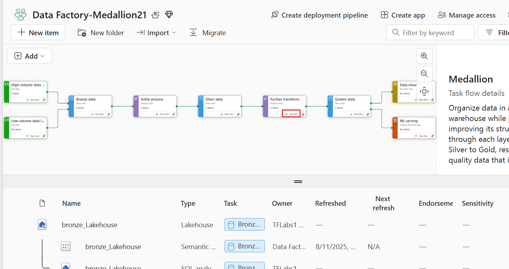

5.  From the list of available items, navigate to the Data Factory
    section and select the **Dataflow Gen2** item

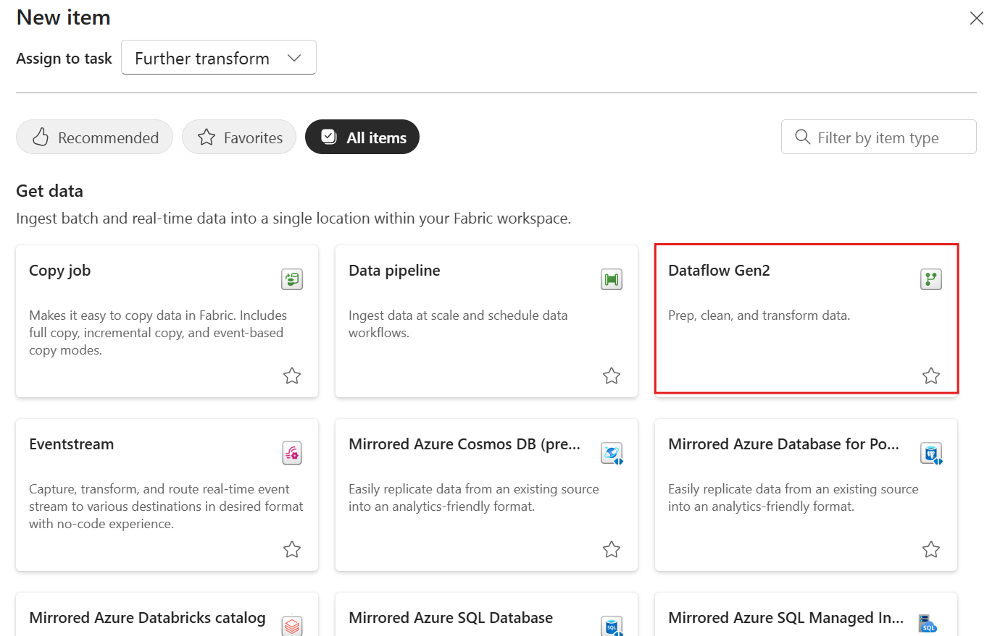

6.  In the **New Dataflow Gen2** window, click on **Dataflow1** and
    rename it to +++**PrepContoso**+++

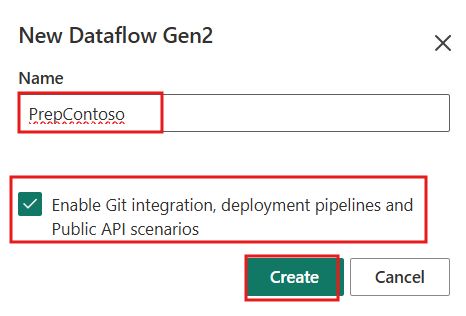

> 

## Task 2: Connecting to lakehouse tables

1.  From the **Home** tab, select **Get data** and then
    the **More...** option.

2.  Within the **Get data** explorer's search bar,
    type +++**silver_Lakehouse+++** to locate the silver lakehouse item.
    Select the **silver_Lakehouse** item within the OneLake catalog's
    returned results.

3.  From the Get data table navigator, select the tables listed below to
    perform data transformation operations and merge the tables for our
    downstream business intelligence projects.

[TABLE]

## Task 3: Preparing data using Power Query Online

1.  Select the **DimCustomer** table and from the **Home** tab, click on
    the **Combine** dropdown, navigate to **Merge Queries**, and choose
    **Merge Queries as New** to create a new merged query.

2.  From the **Merge query** window, set the **Right table for
    merge** to **DimGeography**. In the top right corner, select the
    lightbulb which has detected a possible column match

3.  In this example, both tables contain a column
    titled **GeographyKey**. Select this option to set the columns to be
    merged on. For the join kind, select **Inner** and then **OK** to
    proceed. This activity ensures that the data is accurately combined
    based on matching columns.

4.  Navigate to the far right fo the **DimCustomer** table and select
    the joined **DimGeography** table column's top right corner to
    expand the table, from the available column selections deselect
    **GeographyKey** since this column is what we used to merge on and
    already exists in the dataset before selecting **OK** to continue.

5.  On the right-hand side in the **Query settings** pane, update
    the **Name** of the query to be +++**DimCustomers+++**.

6.  Within the **Query settings** pane, review the Applied steps list,
    which records the steps of your transformations. In this example,
    query folding indicators highlight that our queries are successfully
    folding back to the lakehouse's SQL endpoint for large-scale
    transformations.

Additionally, the options to View data source query and View query plan
allow you to review the generated SQL or the execution plan for the
query. This step ensures that the data transformations are applied
correctly and efficiently, maintaining the integrity and performance of
your dataflow.

7.  Select the **DimProduct** table and from the **Home** tab, navigate
    to the **Merge queries** group and select **Merge queries as new**.

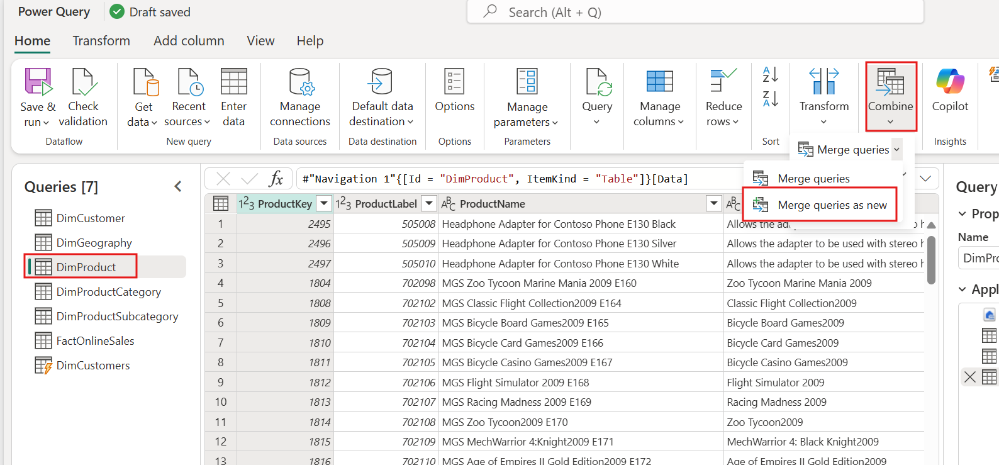

8.  From the **Merge query** window, set the Right table for merge to
    **DimProductSubcategory.**

9.  In the top right corner, select the lightbulb which has detected a
    possible column match. In this example, both tables contain a column
    titled **ProductSubcategoryKey**. Select this option to set the
    columns to be merged on. For the join kind, select **Inner** and
    then **OK** to proceed.

10. Navigate to the far right fo the **DimProduct** table and select the
    joined **DimProductSubcategory** table column's top right corner to
    expand the table, from the avaialble column selections
    deselect **ProductSubCategoryKey** since this column is what we used
    to merge on and already exists in the dataset before
    selecting **OK** to continue.

11. Select the **Merge** query and from the **Home** tab, navigate to
    the **Merge queries** group and select **Merge queries**.

12. From the Merge query window, set the **Right table for
    merge** to **DimProductCategory**. In the top right corner, select
    the lightbulb which has detected a possible column match. In this
    example, both tables contain a column titled **ProductCategoryKey**.
    Select this option to set the columns to be merged on. For the join
    kind, select **Inner** and then **OK** to proceed.

13. Navigate to the far right fo the **DimProduct** table and select the
    joined **DimProductCategory** table column's top right corner to
    expand the table, from the avaialble column selections
    deselect **ProductCategoryKey** since this column is what we used to
    merge on and already exists in the dataset before
    selecting **OK** to continue.

14. On the right-hand side in the Query settings pane, update
    the **Name** of the query to be +++**DimProducts+++**.

## Task 4: **Dataflow Gen2 data destinations and managed settings**

1.  Select the **FactOnlineSales** query and from the **Home** tab,
    select **Add data destination** and then choose
    the **Warehouse** option.

2.  If a connection window asks you to authenticate, confirm your
    credentials.

3.  Otherwise, in the **Choose destination target** window,
    select **gold_Warehouse** and then click **Next**.

**Note:** You can also add to existing tables that have already been
created or rename your tables.

4.  In the **Choose destination settings** window, change the **Update
    method** to **Append**. This will add data to the destination while
    preserving existing rows, which is common for large fact tables
    where you're adding new data and previous record values do not
    change.

5.  In the bottom right-hand corner, hover above the **Data
    destination** field to view the configuration values of your queries
    at a glance. You can also select the settings cog to modify these
    values if necessary.

6.  Select the **DimCustomers** query and from the **Home** tab,
    select **Data destination** and then choose
    the **Warehouse** option.

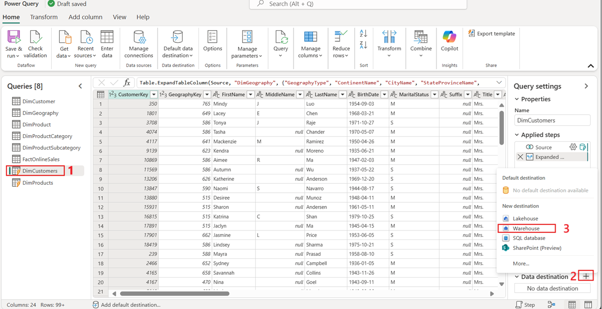

7.  If a connection window asks you to authenticate, confirm your
    credentials and select **Next** button

8.  In the **Choose destination target** window,
    select **gold_Warehouse** and then click **Next**.

9.  In the **Choose destination settings** window, ensure the **Update
    method** is set to the default **Replace** and then click **Save
    settings**. This will delete data from the table and replace the
    values after each refresh.

10. Select the **DimProducts** query and from the **Home** tab,
    select **Data destination** and then choose
    the **Warehouse** option.

11. If a connection window asks you to authenticate, confirm your
    credentials and select Next button.

12. In the **Choose destination target** window,
    select **gold_Warehouse** and then click **Next**.

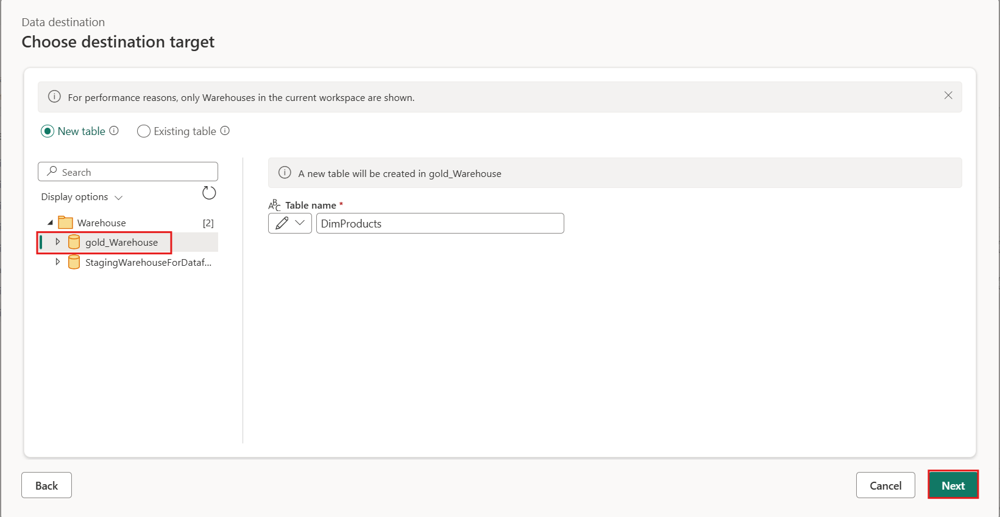

13. In the **Choose destination settings** window, ensure the **Update
    method** is set to the default **Replace** and then click **Save
    settings**. This will delete data from the table and replace the
    values after each refresh.

## Task 5: Group queries and save

1.  Select
    the **DimCustomer**, **DimGeography**, **DimProduct**, **DimProductCategory** and **DimProductSubcategory** queries
    by holding the shift key, as they are all adjacent to each other.
    Right-click and select **Move group**, then select **New group**.

2.  In the New group window, set the properties as needed below and
    select **OK**.

[TABLE]

3.  Select
    the **FactOnlineSales**, **DimCustomers** and **DimProducts** queries
    by holding the control key. Right-click and choose **Move group**,
    then select **New group**.

4.  In the New group window, set the properties as needed below and
    select **OK**. This step helps in organizing your queries into
    logical groups, making it easier to manage and navigate your data.

[TABLE]

5.  In the Home window, select **Save & run** and click on **Save**
    button

## Task 6: Creating a Parameter and Using It in a Filter

1.  On the **Power Query Home** tab, select **Manage Parameters**, then
    choose **New Parameter.** 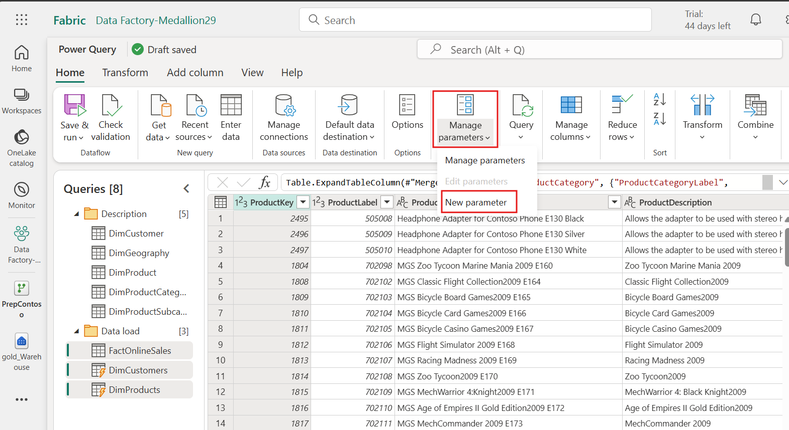

2.  In the **Manage Parameters** dialog, enter the following details:
    set **the Name to SelectedProductKey**, the **Type to Decimal
    Number**, and the **Current Value to 101**, then click **OK** to
    save the parameter**.**

3.  Select the **DimProduct** query and from the **Home** tab

4.  Select the **Productkey** column sort and filter dropdown menu, then
    select **Number filters**, and choose the **Equals...** 

> 

5.  In the **Filter rows** dialog, click the pencil icon next to the
    value field, then select **Select a parameter** to dynamically
    filter rows based on a predefined parameter.

> 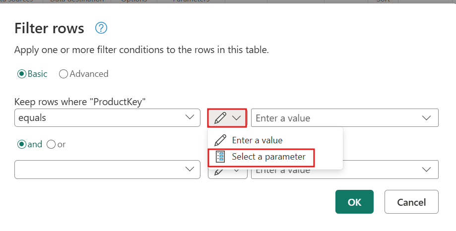

6.  Choose the parameter **SelectedProductKey** from the dropdown list
    to filter rows dynamically based on the selected parameter value.

> 

7.  Click on **Ok** button

> 

8.  This will filter the DimProducts table to only show the product with
    the key you specify.

> 

9.  To modify the parameters, select the **SalesProductKey** parameter
    and click on **Manage Parameters**.

> 

10. In the **Manage Parameters** dialog, enter the **Current value** to
    +++1741+++ and click on **OK** button

> 

9.  In the Query settings pane, select the **Navigation 2**

> 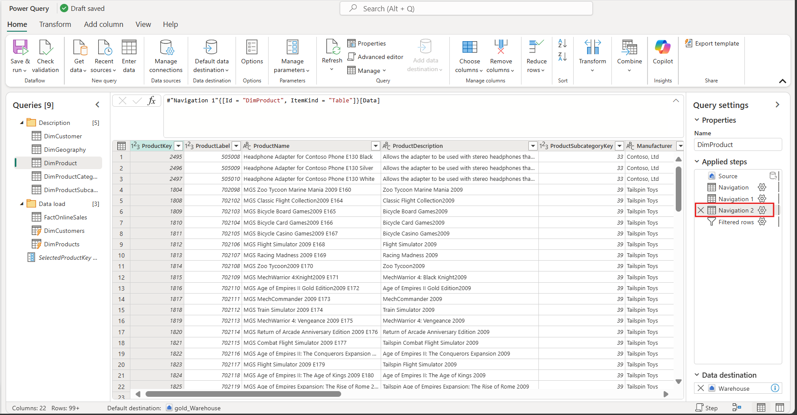

10. Select the **Productkey** column sort and filter dropdown menu, then
    select **Number filters**, and choose the **Greater than...** 

> 

11. Click on **Insert** button

> 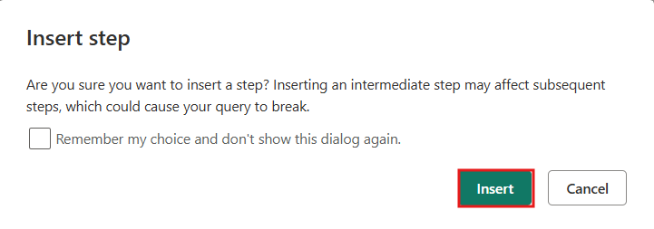
>
> In the **Filter rows** dialog, click the pencil icon next to the value
> field, then select **Select a parameter** and select it. Click on Ok
> button
>
> 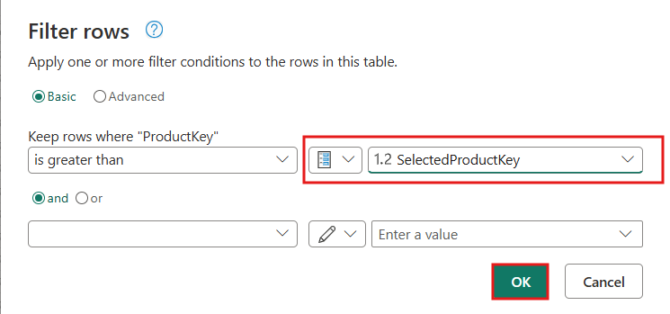
>
> 
>
> **Optional: Link Parameters to Other Queries**
>
> You can use the same parameter to filter related tables like:

- FactSales

- DimProductSubcategory

> This helps create **interactive reports** where users can select a
> product and see related sales or category data.

## Task 7: Create a custom function from a table reference

1.  In the Queries pane select **SelectedProductKey** and enter the
    Current value and click on Apply

2.  Right-click on the **SelectedProductKey** parameter in the Queries
    pane and select **Reference** to create a new query that references
    this parameter

3.  Rename it to something like **fxTransformProduct**.

4.  Right-click on the **SelectedProductKey** parameter in the Queries
    pane and select **Create function**

2.  In the Create function window, set the Fuction name to
    +++**Transform file**+++ and then select **OK**. 

5.  Select the parameter

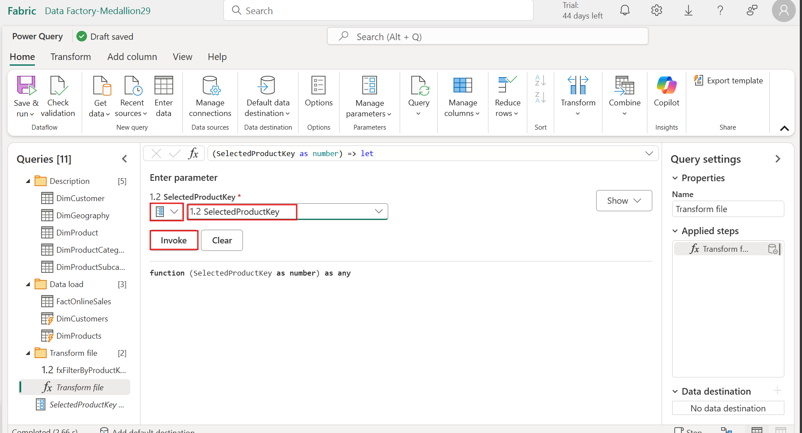

6.  In Power Query Editor, go to **Home \> New Source \>
    Query**\>**Advanced editor**

6.  In the formula bar, enter:

> (SelectedProductKey as number) =\>
>
> let
>
>     Source = DimProducts,
>
>     FilteredRows = Table.SelectRows(Source, each \[ProductKey\] = SelectedProductKey),
>
>     Transformed = Table.TransformColumns(FilteredRows, {{"ProductName", Text.Upper}})
>
> in
>
>     Transformed
>
> 
>
> 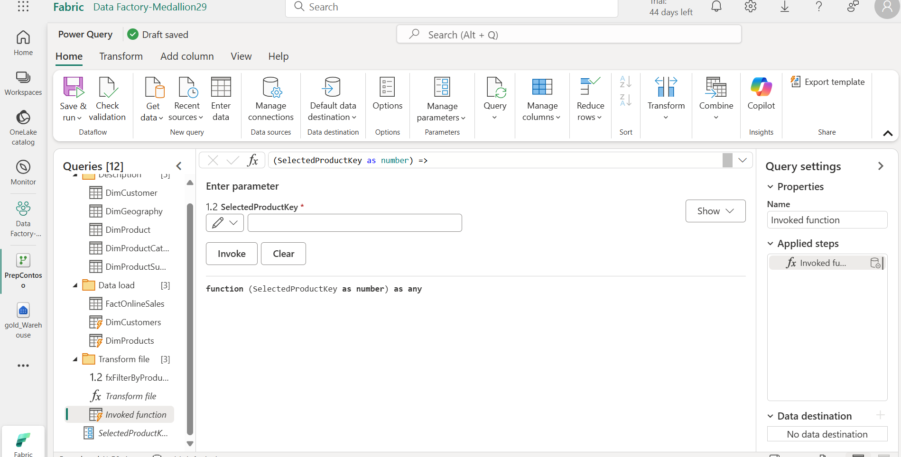

7.  In the Query settings , enter the name as **fxTransformProduct**

> 

8.  Select the parameter and click the **Invoke**

> 
>
> 

This function filters DimProducts by ProductKey and transforms
the ProductName to uppercase.

9.  Select Transform file function

1.  

&nbsp;

10. In the formula bar, enter:

> fxFilterByProductKey(SelectedProductKey)

## Task 8: Using List-Based Parameters to Enhance Query Flexibility

1.  In the Power Query Editor, go to the **Home** tab.

2.  Click on **Manage Parameters** \> **New Parameter**.

> 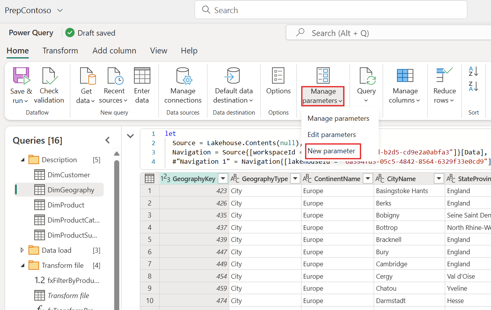

3.  In the **Manage Parameters** dialog, enter the following details:
    set **the Name to Product**, select R**equired** the **Type
    to List**, and the enter the values like** 447,432**,**459** then
    click **OK** to save the parameter**.**

7.  Select the '**DimCustomer'** query, then click the data type icon in
    the '**CustomerKey**' column header to open the dropdown menu, and
    choose the appropriate data type to convert the column from **Number
    filters** to **'In**' type for enhanced filtering.

8.  In the **Filter rows** tab, select the **product** parameter

> 
>
> 

## Task 9: Use public parameters in Dataflow Gen2 and Save to Warehouse Destination

1.  In the Power Query Editor, go to the **Home** tab.

2.  Click on **Manage Parameters** \> **New Parameter**.

> 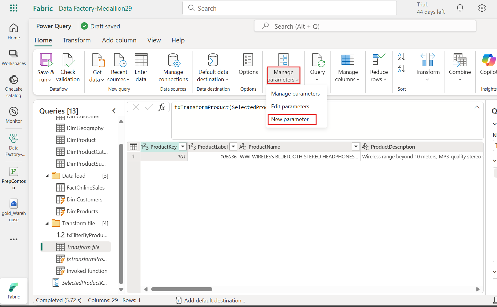

3.  In the **Manage Parameters** dialog, enter the following details and
    then click **OK** to save the parameter

- Name- Enter **+++workspaceId**+++

- Select the **Required** check box

- Type **– Text**

- Current Value**- 1**

> 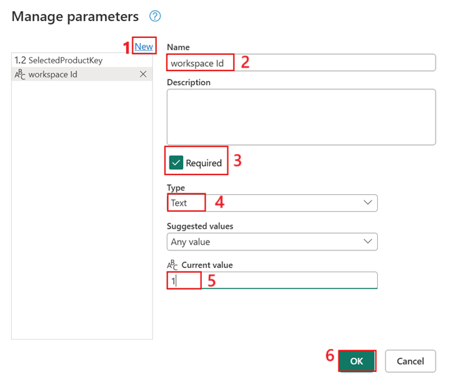
>
> 

4.  In the Queries pane, select **DimCustomer**

> 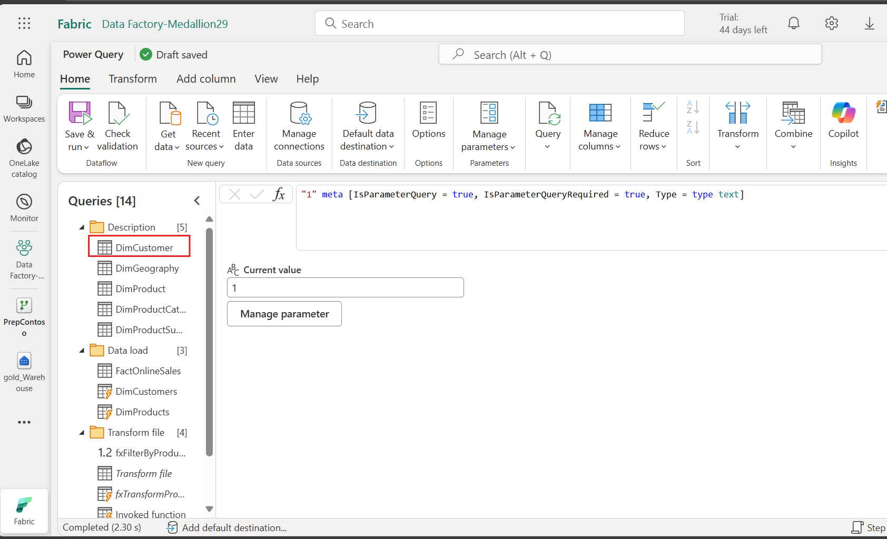

5.  Select the **Navigation** in the **Query settings,** Copy the
    **workspaceId**

> 

**Note:** Copy the workspace Id, bronze_Lakehouse Id, silver_Lakehouse
Id and save them in a notepad.

> 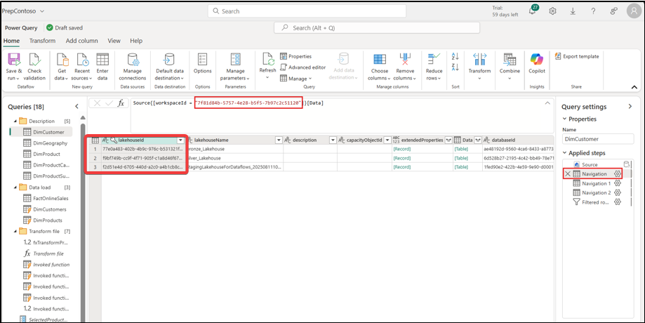

6.  Select the **workspaceId** parameter and paste the Current value as
    workspaceId. Click on **Apply** button

> 

7.  Select **DimCustomer** table

> 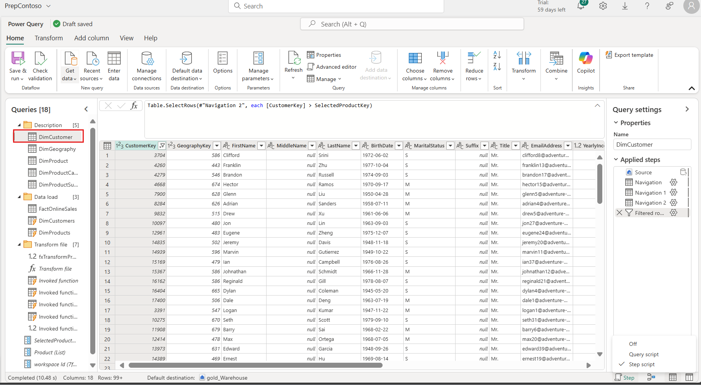

8.  In the ***View*** tab, select *Query Script* to open the script
    editor.

> 

9.  In the query script editor, replace the **workspaceId** value as
    workspaceId parameter name

> 
>
> 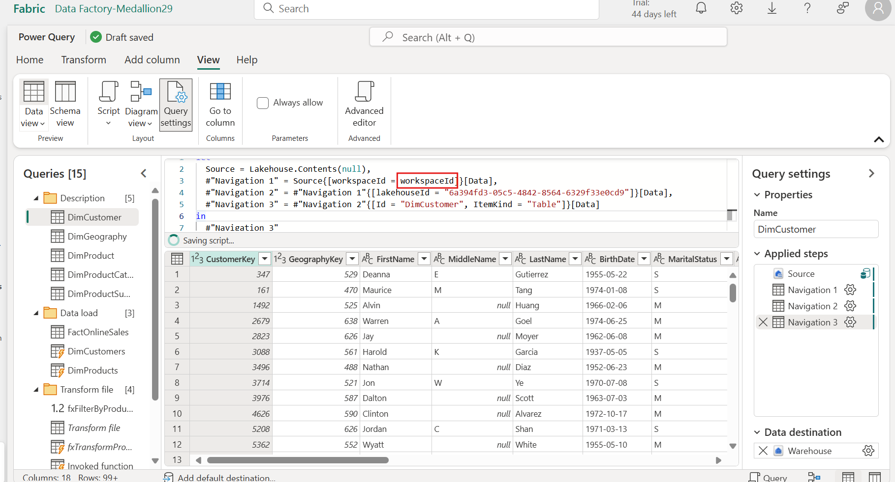
>
> 

14. Select the **workspaceId** parameter and from the **Home** tab,
    select **Add data destination** and then choose
    the **Warehouse** option.

> 
>
> 

15. If a connection window asks you to authenticate, confirm your
    credentials and select Next button.

> 

17. In the **Choose destination target** window,
    select **gold_Warehouse** and then click **choose**.

> 

18. Click on **Bind selected queries**

> 
>
> 

19. In the Power Query Editor, go to the **Home** tab.

20. Click on **Manage Parameters** \> **New Parameter**.

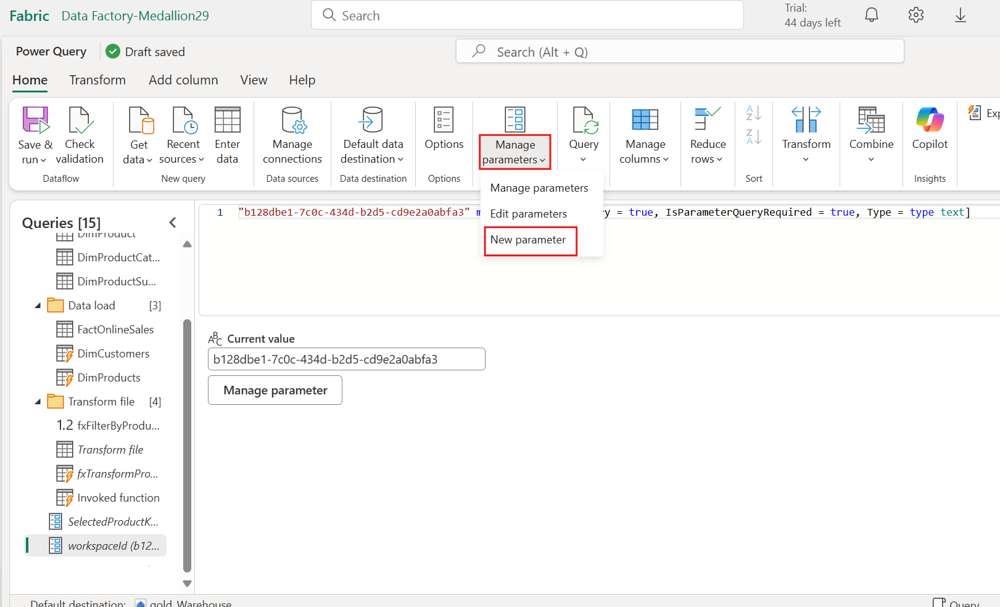

21. In the **Manage Parameters** dialog, enter the following details and
    then click **OK** to save the parameter

- Name- Enter **+++lakehouseId**+++

- Select the **Required** check box

- Type **– Text**

- Current Value**- 2**

> 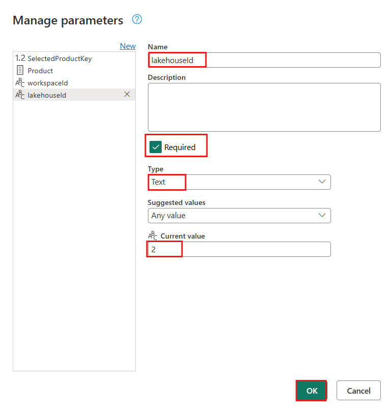

22. Select the DimCustomer and select the **Navigation** in the **Query
    settings,** Copy the **silver_Lakehouse Id**

> 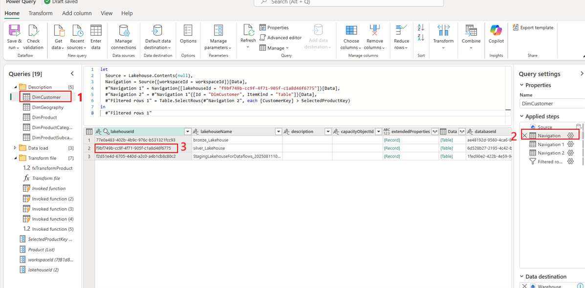

23. Select the **lakehouseId** parameter and paste the Current value as
    lakehouseId. Click on **Apply** button

> 

24. In the DimCustomer query script editor, replace the **lakehouseId**
    value as lakehouseId parameter name

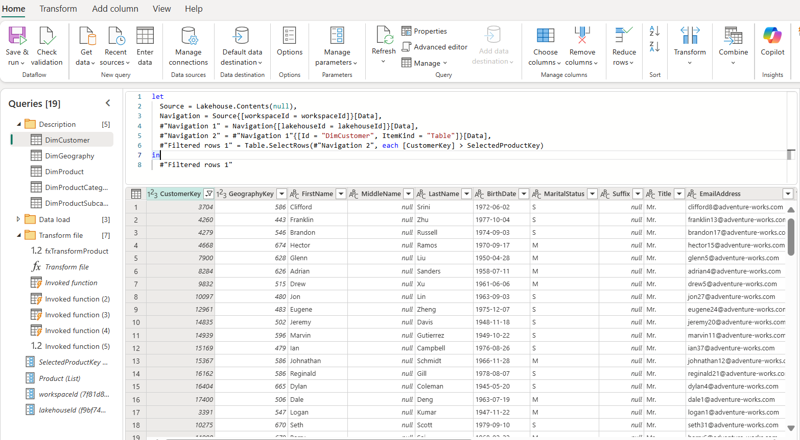

## Task 10: Pattern to incrementally amass data with Dataflow Gen2

1.  Select **DimCustomers** from the Data Load pane, then on the Home
    tab of the ribbon, choose **Choose Column***s* from the *Manage
    Columns* group**.**

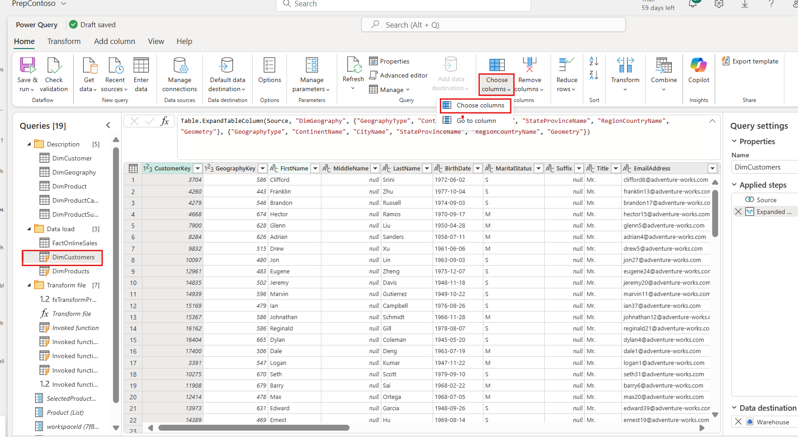

2.  In the Choose Columns tab, select the below columns and click on
    **Ok** button

- CutomerKey

- GeographyKey

- FirstName

- BirthData

- EmailAddress

- AddressLine1

- Phone

- DateFirstPurchase

- Geometry

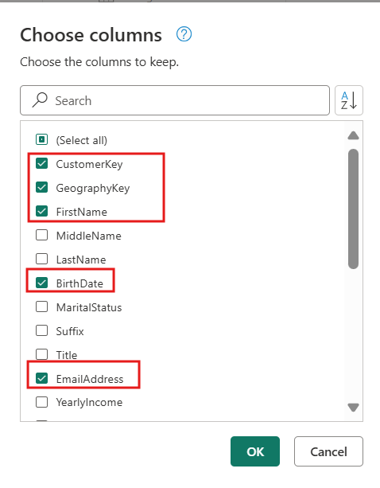

3.  Select the data type icon in the column header of the fourth
    column, **BirthDate**, to display a dropdown menu and select the
    data type from the menu to convert the column from to **Date** type.

> 
>
> 

4.  Set up the data destination to your warehouse using the following
    settings:

- Data destination: Warehouse

- Lakehouse: Select the lakehouse you created in step 1.

- New table name: DimCustomers

- Update method: Replace

> 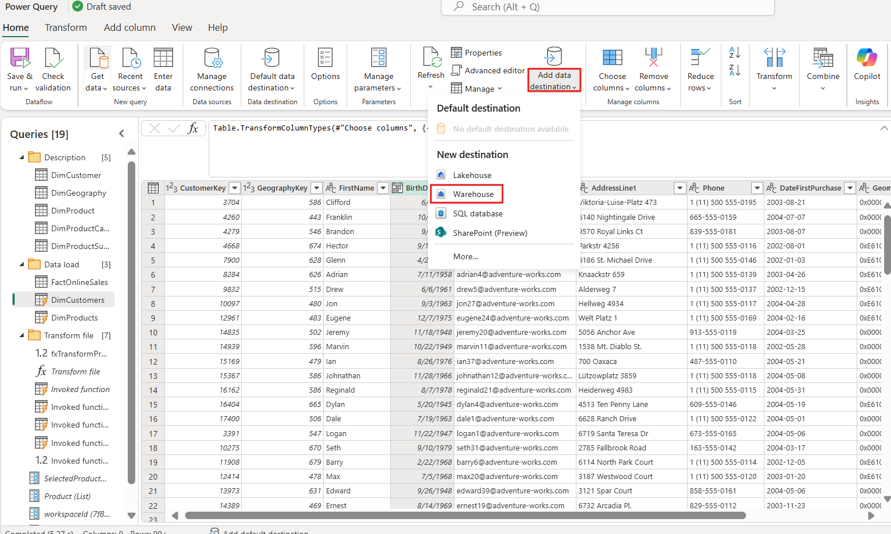
>
> 
>
> 

5.  Disable staging of this DimCustomers query. Right click on
    **DimCustomers** and select **Enable staging**

> 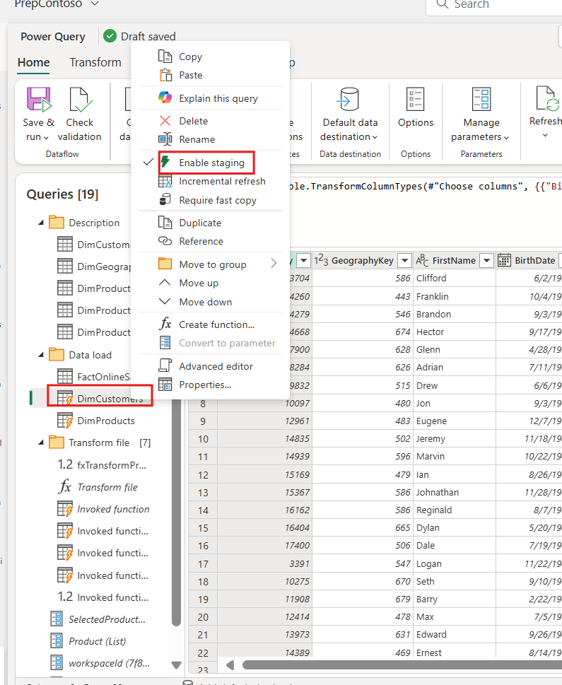

6.  Click on Ok

> 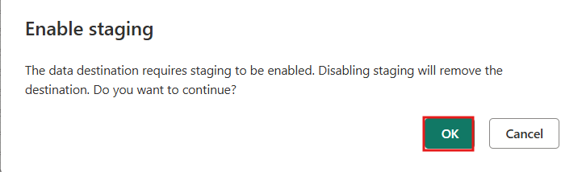

7.  In the data preview, right-click on the CustomerKey column and
    select **Drill down**.

> 
>
> 

8.  From the ribbon, select **List
    Tools** -\> **Statistics** -\> **Maximum**.

> 
>
> 

9.  In the Home window, select **Save & run** and click on **Save &
    run** button

> 

10. In the left-sided navigation menu, navigate and click on ***Data
    Factory-MedallionXX***, as shown in the below image.

> 

## Task 11: Further transform task flow

1.  From the task flow, select the **Further transform** task and click
    on the paper clip icon to assign a previously created item.

2.  Select the **PrepContoso** item and then press **Select**.

## Task 12: Copy job into the warehouse

1.  From the task flow, select the **Further transform** task and click
    on the **New item** option. Within the Create an item pane display
    properties, change the toggle to the **All items** option.

2.  From the list of available items, navigate to the Data Factory
    section and select the **Copy job** item.

3.  In the New copy job window, set the copy job name
    to +++**CopyContoso+++** and then select **Create**.

4.  From the Copy job window, search for the data source starting
    with **silver_Lakehouse** in the search bar and then
    select **silver_Lakehouse** from the OneLake catalog list.

You can also use the OneLake tab at the top if you want to set
additional criteria such as filters or item types.

5.  Now that you're on the **Choose data** step, select the following
    tables:

- DimDate

- DimEmployee

- DimStore

6.  The copy job also supports a limited set of transformations such as
    column mapping, setting schema names, and renaming tables. Expand
    the **DimStore** table and then deselect
    the **GeoLocation** and **Geometry** columns. Once done,
    select **Next** to continue.

7.  Within the Choose data destination step, search for the data source
    starting with +++**gold_Warehouse+++** in the search bar and then
    select **gold_Warehouse** from the OneLake catalog list.

8.  Within the **Map to destination** step, you can review the added
    tables and update the schema or table names. Once done reviewing,
    select **Next** to continue.

9.  On the **Settings** step, review the Copy job mode options and then
    select **Next** to continue.

10. On the Review + save step, deselect the **Start data transfer
    immediately** option and then select **Save** to continue.

11. Now that you've reviewed the configuration, from the **Home** tab,
    select the **Run** option to begin copying data from the lakehouse
    into the warehouse.

To configure the copy job items' name, description, refresh schedule, or
other properties, you can select the settings icon (cog) to edit.

12. You can monitor the copy job in the **Results** tab at the bottom to
    confirm that it has successfully completed.

13. Hover over the copy job on the left side-rail and select
    the **X** to close it.

## Task 13: End-to-end orchestration with pipelines

1.  In the left-sided navigation menu, navigate and click on ***Data
    Factory-MedallionXX***, as shown in the below image.

> 

2.  Within the workspace, select the **Initial process** task flow item
    and from the filtered list, select
    the **createContosoTables** pipeline.

3.  From the **Home** tab, add a new **Dataflow** activity to the
    pipeline.

4.  Drag the **On success** conditional path between the **For each
    file** activity and the new **Dataflow1** activity.

5.  Select **Dataflow**, select **Settings** section and within the
    Dataflow drop-down, select the **PrepContoso** dataflow.

6.  With the dataflow activity still selected, go to the **General** tab
    and update the activity name to +++**PrepContoso+++**.

7.  Once complete, select the **Save** icon.

8.  In the left-sided navigation menu, navigate and click on ***Data
    Factory-MedallionXX***, as shown in the below image.

9.  Within the workspace, select the **High-volume data ingest** task
    flow item and from the filtered list, select
    the **getContosoSample** pipeline.

10. From the **Home** tab, add the **Invoke Pipeline
    (Preview)** activity.

11. Create a conditional **On success** path between the **Get and Unzip
    files** activity and the **Invoke pipeline1** activity.

12. Select the **Invoke Pipeline** activity, then expand the
    **Connection** field under the **Settings** tab.

4.  In the Get data tab, type +++**Fabric Data Pipelines+++** and Select
    it.

5.  Select **Sign in** button and select the credentials

6.  In the **Connect data source** tab, select **Connect**

13. From the **activity** settings **Pipeline** option, select
    the **createContosoTables** pipeline.

14. With the invoke pipeline activity still selected, go to
    the **General** tab and update the activity **Name** to +++**Invoke
    createContosoTables+++**.

15. Once complete, select the **Save** icon and then **Run**.

**Note:** You can set a schedule from this first pipeline, and it will
call the subsequent pipelines and its dataflow upon successful
completion or have the pipeline triggered by events like when new files
are added to the lakehouse.

**Important:** Designing modular pipelines makes development, testing,
and maintenance easier. They are also portable, allowing components to
be reused across different projects. This approach is particularly
beneficial in large-scale data processing environments, where
reusability and modularization are key to efficient data integration
workflows.

16. From the **Output** pane monitor that the activities
    and **Succeedded** and once done close the pipeline by selecting
    the **X** on the left side-rail to return to the workspace.

17. In the left-sided navigation menu, navigate and click on ***Data
    Factory-MedallionXX***, as shown in the below image.

> 

# Exercise 2: Automate and send notifications with Data Factory

## Task 1: Add an Office 365 Outlook activity to your pipeline

1.  In the **Data_FactoryXX** view, select the **First_Pipeline1**.

> 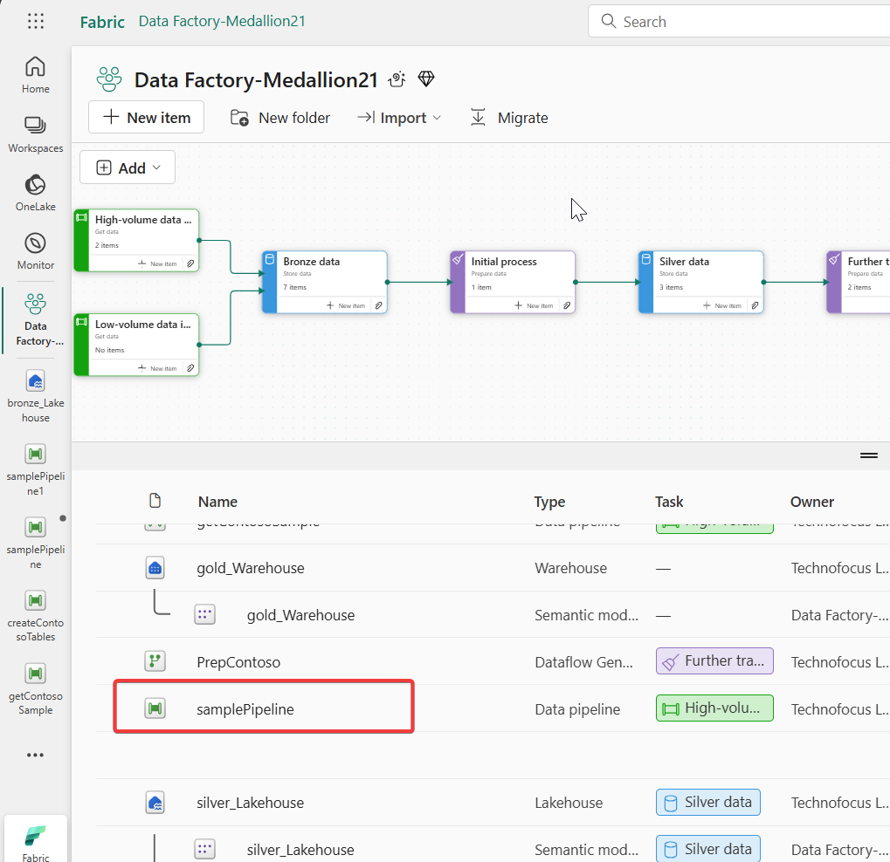

2.  Select the **Activities** tab in the pipeline editor and find the
    **Office Outlook** activity.

> 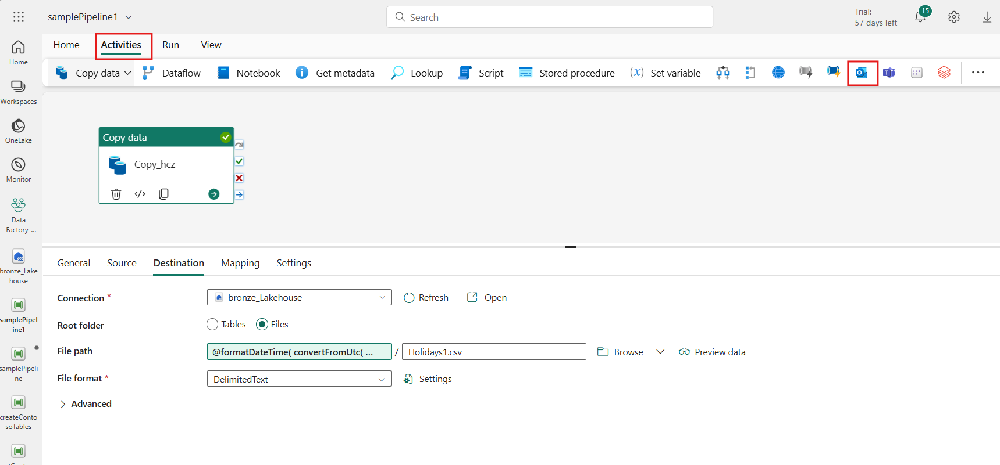

3.  Select and drag the On success path (a green checkbox on the top
    right side of the activity in the pipeline canvas) from your Copy
    activity to your new Office 365 Outlook activity.

4.  Select the Office 365 Outlook activity from the pipeline canvas,
    then select the **Settings** tab of the property area below the
    canvas to configure the email. Click on **Sign in** button.

> 

5.  Select your Power BI organizational account and then select **Allow
    access** to confirm.

> 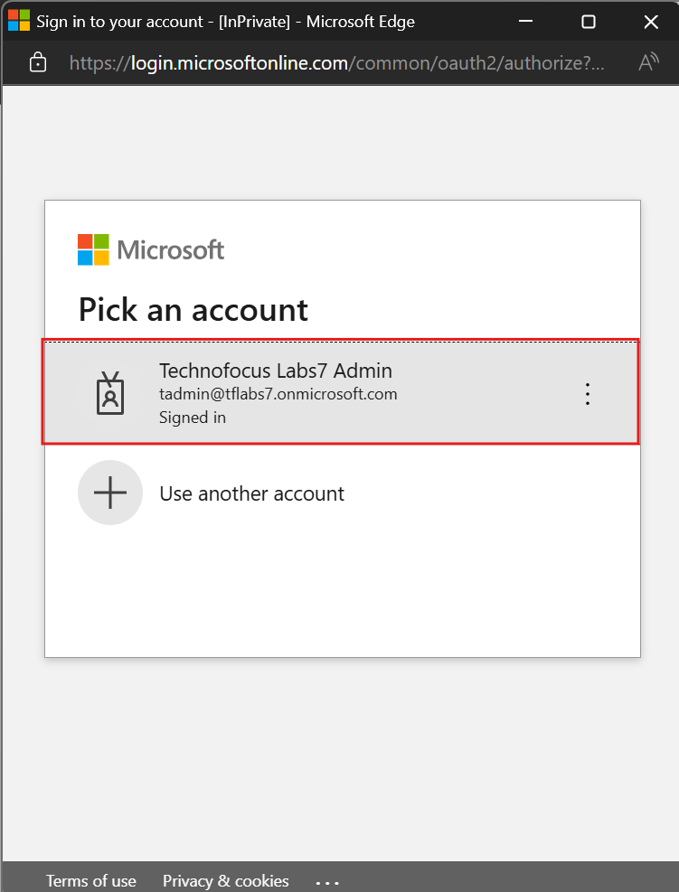
>
> 

6.  Select the Office 365 Outlook activity from the pipeline canvas, on
    the **Settings** tab of the property area below the canvas to
    configure the email.

    - Enter your email address in the **To** section. If you want to use
      several addresses, use **;** to separate them.

    &nbsp;

    - For the **Subject**, select the field so that the **Add dynamic
      content** option appears, and then select it to display the
      pipeline expression builder canvas.

> 

7.  The **Pipeline expression builder** dialog appears. Enter the
    following expression, then select **OK**:

> *+++@concat('DI in an Hour Pipeline Succeeded with Pipeline Run Id',
> pipeline().RunId)+++*
>
> 

8.  For the **Body**, select the field again and choose the **View in
    expression builder** option when it appears below the text area. Add
    the following expression again in the **Pipeline expression
    builder** dialog that appears, then select **OK**:

> *+++@concat('RunID = ', pipeline().RunId, ' ; ', 'Copied rows ',
> activity('Copy data1').output.rowsCopied, ' ; ','Throughput ',
> activity('Copy data1').output.throughput)+++*
>
> 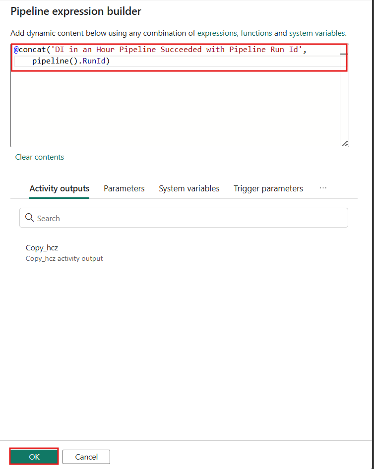

9.  For the **Body**, select the field again and choose the **View in
    expression builder** option when it appears below the text area. Add
    the following expression again in the **Pipeline expression
    builder** dialog that appears, then select **OK**:

> *+++@concat('RunID = ', pipeline().RunId, ' ; ', 'Copied rows ',
> activity('Copy data1').output.rowsCopied, ' ; ','Throughput ',
> activity('Copy data1').output.throughput)+++*
>
> 
>
> 

**  Note:** Replace **Copy data1** with the name of your own pipeline
copy activity.

10. Finally select the **Home** tab at the top of the pipeline editor,
    and choose **Run**. Then select **Save and run** again on the
    confirmation dialog to execute these activities.

> 
>
> 

11. After the pipeline runs successfully, check your email to find the
    confirmation email sent from the pipeline.

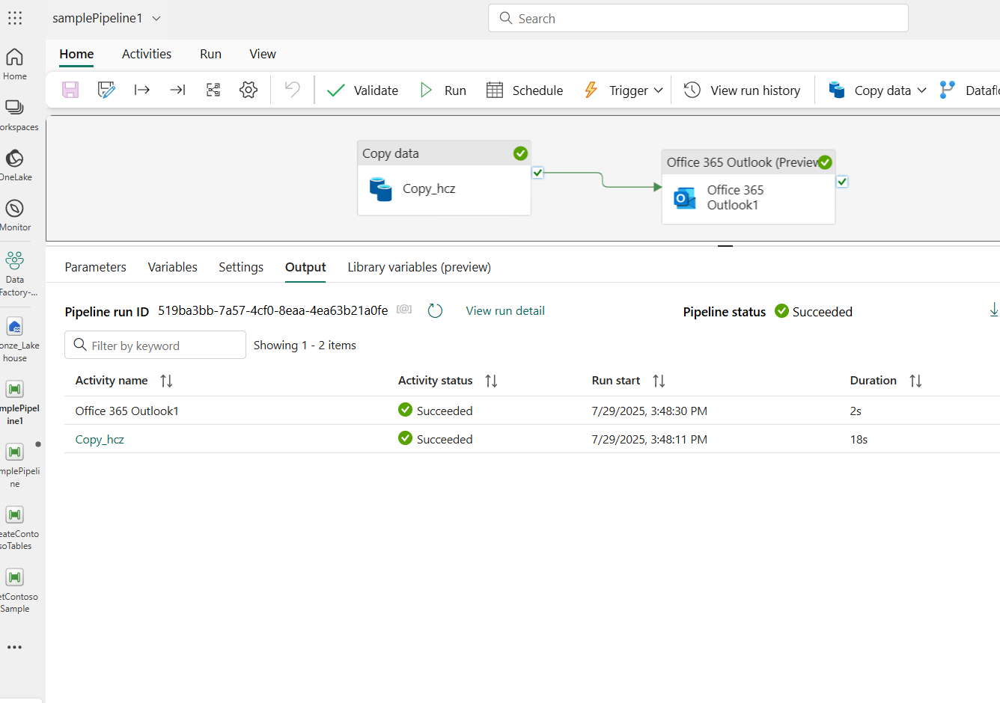

**Task 2: Schedule pipeline execution**

Once you finish developing and testing your pipeline, you can schedule
it to execute automatically.

1.  On the **Home** tab of the pipeline editor window,
    select **Schedule**.

2.  Configure the schedule as required. The example here schedules the
    pipeline to execute daily at 8:00 PM until the end of the year.

**Task 3: Add a Dataflow activity to the pipeline**

1.  Hover over the green line connecting the **Copy activity** and the
    **Office 365 Outlook** activity on your pipeline canvas, and select
    the **+** button to insert a new activity.

2.  Choose **Dataflow** from the menu that appears.

3.  The newly created Dataflow activity is inserted between the Copy
    activity and the Office 365 Outlook activity, and selected
    automatically, showing its properties in the area below the canvas.
    Select the **Settings** tab on the properties area, and then select
    your dataflow created

4.  Select the **Home** tab at the top of the pipeline editor, and
    choose **Run**. Then select **Save and run** again on the
    confirmation dialog to execute these activities.

> 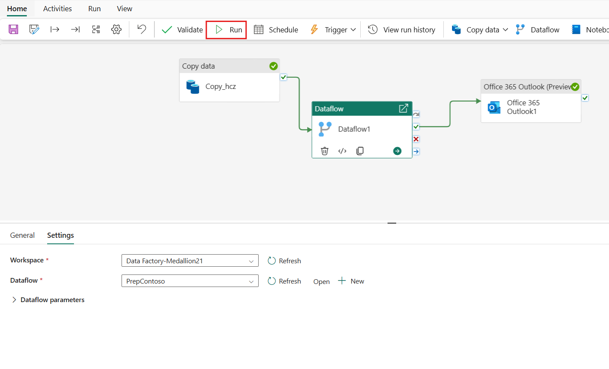

## Task 4: Create a semantic model and build a report

1.  Within the workspace, select the **Golden data** task flow item and
    from the filtered list, select the **gold_Warehouse** Warehouse.

> 

2.  On the **gold_Warehouse** page, expand the Table under the dbo,
    right-click on the **'DimCustomer'** table, select **'New SQL
    Query',** and then click on **'Select Top 100'.**

> 
>
> 

3.  In gold_Warehouse page, select the ***Reporting* **tab and then
    select ***New semantic model***.

> 

4.  In the New semantic model tab, enter the name as +++***Sample
    model+++*,** and select **dbo**. Click on the **Confirm** button.

> 

5.  In the left-sided navigation menu, navigate and click on ***Data
    Factory-MedallionXX***, as shown in the below image.

> 

6.  Select ***Sample model***

> 
>
> 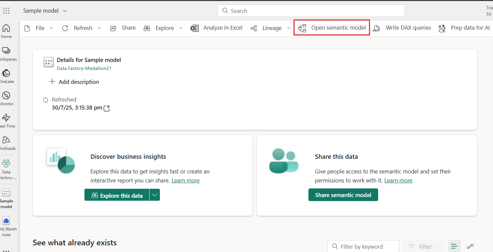

7.  From the semantic model pane, you can view all the tables. You have
    options to create reports either from scratch, paginated report, or
    let Power BI automatically create a report based on your data. For
    this tutorial, under **Explore this data**, select **Auto-create a
    report** as shown in the below image.

> 

8.  

> 
>
> 
>
> 
>
> 
>
> 
>
> 
>
> 

# Exercise 3: Use Variable libraries to customize and share item configurations (preview)

This task shows you how to use dynamic content in data pipelines. Create
a Variable library item and add variables to it so that you can automate
different values for different stages of your deployment pipeline. In
this task, we copy data from one lakehouse to another, and use the
Variable library to set the source and destination values for the copy
activity.

## Task 1: Create the data movement workspace

First, we'll create a workspace and Lakehouse that will be used as our
initial staging data.

1.  In the **Home** page click on **+ New Workspaces** as shown in the
    below image.

> 

2.  In the **Create a workspace** pane that appears on the right side,
    enter the following details, and click on the **Apply** button.

[TABLE]

> 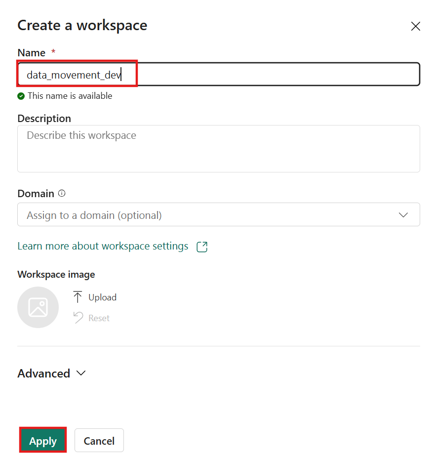

3.  Create a new lakehouse by clicking on the **+New item** button in
    the navigation bar.

4.  Click on the "**Lakehouse**" tile.

> 

5.  Enter a name for the Lakehouse - ***source_lakehouse*** and
    click **Create**.

6.  In the Lakehouse home page , click on the settings and copy the
    Lakehouse Id and save in notepad

7.  You should now be in the Lakehouse, select **New data pipeline**.

> 

8.  Enter the name **pl_sourcedata_pipeline** and click **Create**.

9.  You should now see **Copy data into Lakehouse**, at the top
    select **Sample data**. Select **Public Holidays**.

> 

10. Once it has finished loading, click **Next**.

> 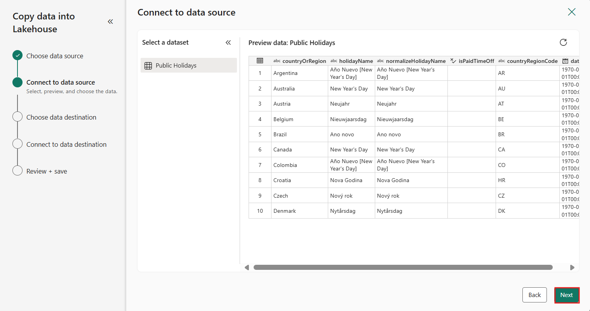

11. On the **Connect to data destination** screen, click **Next**.

> 

12. On the **Review + Save** screen, click **Save + Run**.

> 

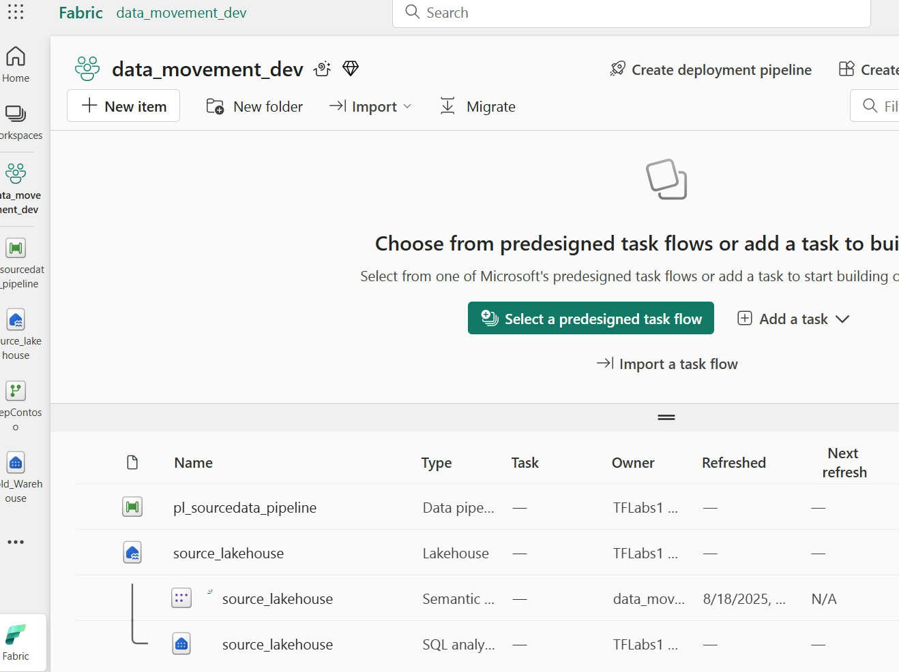

## Task 2: Create Deployment Pipeline

Now, we create our deployment pipeline.

1.  In the workspace, click **create deployment pipeline**.

> 

2.  Select **New pipeline**

> 

3.  In the **Create deployment pipeline** dialog box, enter a name and
    description for the pipeline, and select **Next**.

> 

4.  Set your **deployment pipeline’s structure** by defining the
    required stages for your deployment pipeline. By default, the
    pipeline has three stages: *Development*, *Test*, and *Production*.
    We are keeping it **as it is** for now. Click on **Create and
    Continue**.

> 

5.  In the stage you want to assign a workspace to, expand the dropdown
    titled **Add content to this stage** and select the workspace and
    click on the **tick** icon.

> 
>
> 

6.  Click on the **Test** stage, at the bottom, place a check at the top
    to select all items. Now *select* the *silver_Lakehouse,
    gold_warehouse and*  bronze_lakehouse.

> 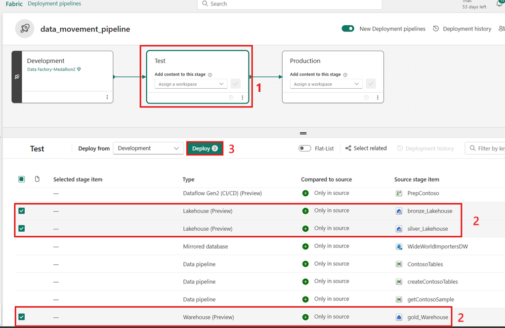

7.  Click the **Deploy** button. Click **Deploy** again.
    The **Test** stage should now be populated.

> 
>
> 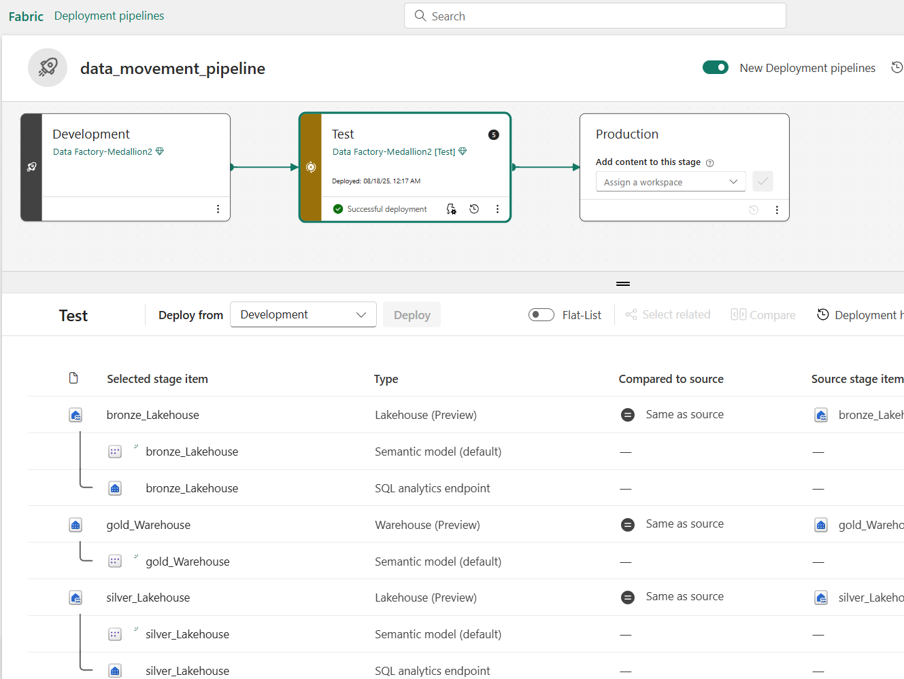

8.  Click on the **Production** stage, at the bottom, place a check at
    the top to select*, gold_warehouse and*  silver_Lakehouse. Click
    the **Deploy** button. Click **Deploy** again.
    The **Production** stage should now be populated.

> 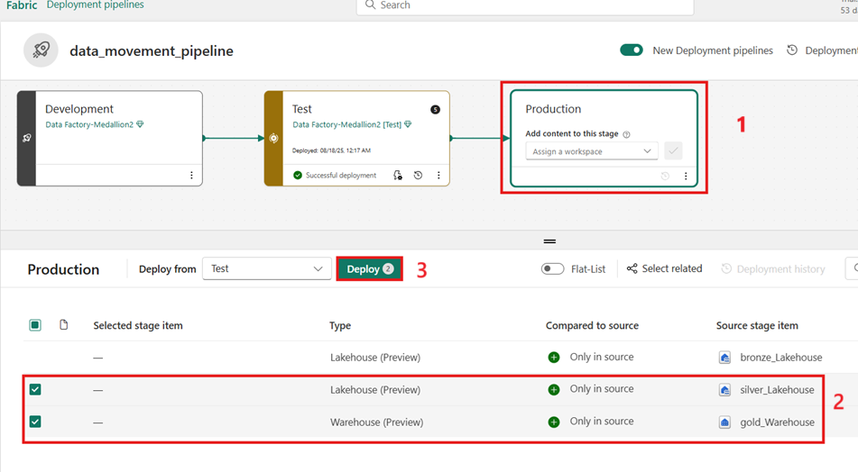
>
> 
>
> 

9.  Now Test and Production workspaces are created

> 

## Task 3: Get the Workspace IDs and Object IDs for Lakehouses

1.  Select the **Data Factory-MedallionXX** workspace.

> 

2.  In the workspace, click on the *bronze_lakehouse* Lakehouse.

> 

3.  Copy the workspace ID and the Lakehouse object ID in the URL.

> 

4.  Select the **Data Factory-MedallionXX\[Test\]** workspace.

> 

5.  In the workspace, click on the *silver_Lakehouse* Lakehouse.

> 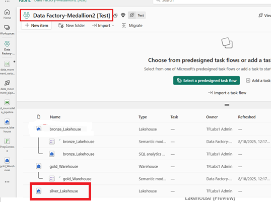

6.  Copy the workspace ID and the Lakehouse object ID in the URL.

> 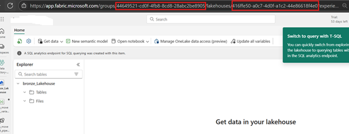

7.  Select the **Data Factory-MedallionXX\[Production\]** workspace.

> 

8.  In the workspace, click on the ***gold_warehouse***

> 

9.  Copy the workspace ID and the Lakehouse object ID in the URL.

> 

10. Select the Settings

> 

11. Copy the SQL end point

> 

12. Select the **data_movement_dev** workspace.

> 

13. In the workspace, click on the ***source_lakehouse***

14. Copy the workspace ID and the Lakehouse object ID in the URL.

## Task 4 :Create a variable library with variables

1.  On the right, under **Develop data**, select **Variable Library
    (preview)**.

> 

2.  Name the library **data_movement_variable** and click **Create**.

> 
>
> 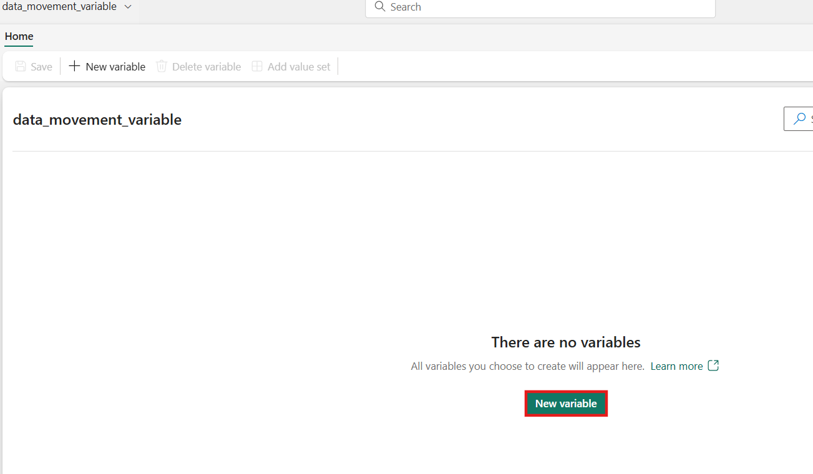

3.  Click **New Variable**.

> 

7.  Create the following variables. Create default variables for each
    item in the table.

[TABLE]

> 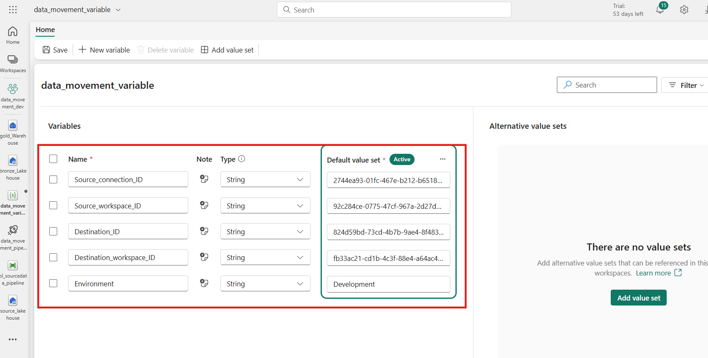

4.  In the variable library, on the right, click **Add value set**.

> 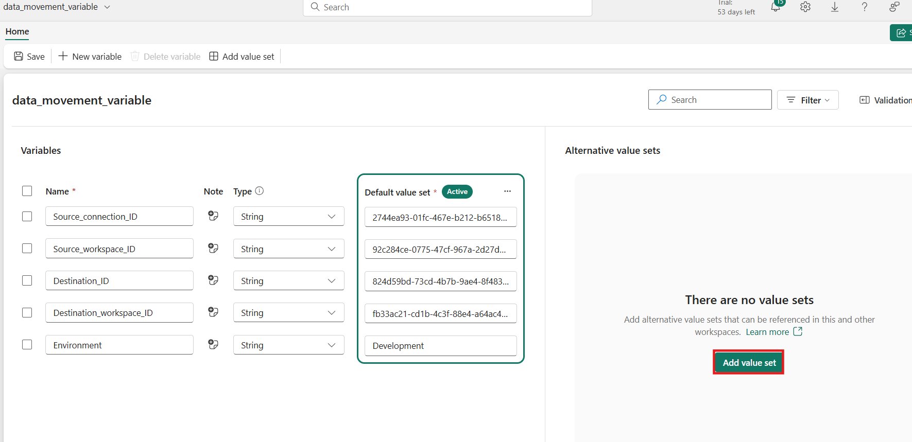

5.  Enter *Dev* for the name and click **Create**.

> 
>
> 

6.  In the variable library, on the right, click **Add value set**.

> 

7.  Enter *Test* for the name and click **Create**.

> 

8.  Create the following variables. Create Test variables for each item
    in the table.

[TABLE]

> 

8.  In the  **Variables** variable library, on the right, click **Add
    value set**.

> 

9.  Enter **Production** for the name and click **Create**.

> 

9.  Create the following variables. Create Test variables for each item
    in the table.

[TABLE]

> 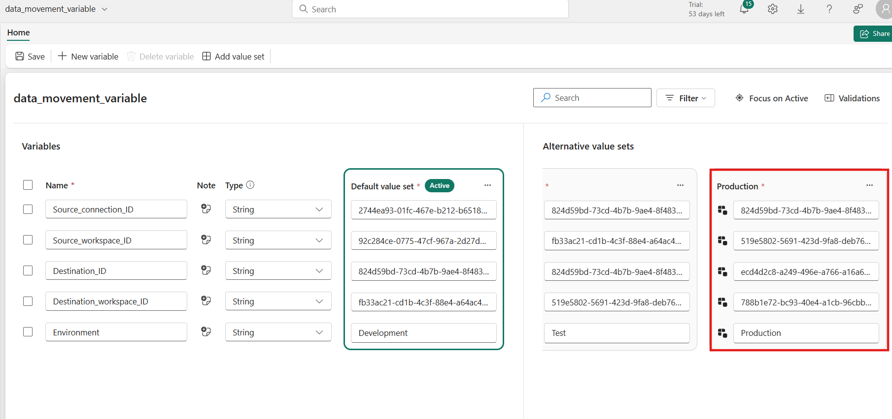

10. Once you're done, click **Save** and **Agree**.

> 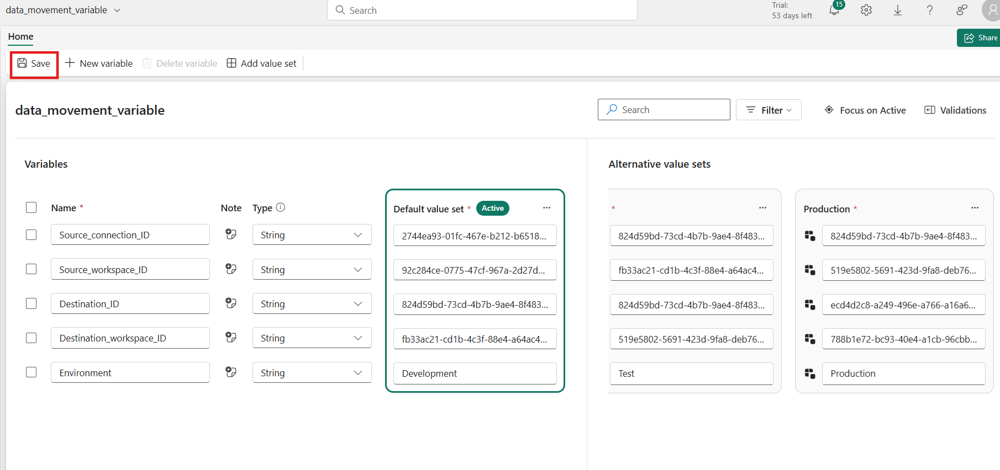
>
> 

## Task 5: Verify and test the variable library

1.  In the *data_movement_dariable* select the **Dev** stage.

2.  On the test stage, click the **...** and select **Set as active**.

> 

3.  Click the **Set as Active** button.

> 

4.  Now, select data_movement_dev workspace

> 

5.  Click on the pipeline

> 

6.  Click on the canvas so that the focus is off of **Copy data**.

7.  At the bottom, select **Library variables (preview)**.

> 

8.  Click **New** and add the variables that are in the table below.

[TABLE]

> 
>
> 

9.  Click on Save

> 

10. On the canvas, select **Copy Data** so the focus is on **Copy
    Data**.

> 

11. Under **Source \> Connection**, select **Use dynamic content**.

> 

12. On the right, click **...** and select **Library variables
    preview**.

13. Select **source_connection_ID**. It populates the box
    with @pipeline().libraryVariables.source_connection_ID.
    Click **Ok**.

> 

1.  Under **Source \> Workspace**, select **Use dynamic content**.

&nbsp;

1.  On the right, click **...** and select **Library variables
    preview**.

&nbsp;

1.  Select **Source_workspace_ID**. It will populate the box
    with @pipeline().libraryVariables.Source_workspace_ID. Click **Ok**.

> 
>
> 

1.  Under **Source \> Tables**, place a check in **Enter manually**,
    click on the **table name** box and select **Use dynamic content**.

&nbsp;

1.  On the right, click **...** and select **Library variables
    preview**.

&nbsp;

1.  Select **SourceTableName**. It will populate the box
    with @pipeline().libraryVariables.SourceTableName. Click **Ok**.

> 
>
> 

5.  Under **Destination \> Workspace**, select **Use dynamic content**.

> 

6.  On the right, click **...** and select **Library variables
    preview**.

7.  Select **SourceLH**. It will populate the box
    with @pipeline().libraryVariables.DestinationLH. Click **Ok**.

> 

8.  Under **Destination \> Workspace**, select **Use dynamic content**.

9.  On the right, click **...** and select **Library variables
    preview**.

10. Select **DestinationWSID**. It will populate the box
    with @pipeline().libraryVariables.DestinationWSID. Click **Ok**.

11. Under **Destination \> Tables**, place a check in **Enter
    manually**, click on the **table name** box and select **Use dynamic
    content**.

12. On the right, click **...** and select **Library variables
    preview**.

13. Select **DestinationTableName**. It will populate the box
    with @pipeline().libraryVariables.DestinationTableName.
    Click **Ok**.

14. Click on the **Run**

> 

15. In the **Save and run?** dialog box, click on **Save and
    run** button to execute these activities. This activity will take
    around less than 1 min.

> 

14. Select the workspace Data Factory-Medallion2

> 

15. Click on the bronze_Lakehouse

> 

16. Select the tables

> 

17. Now select the data_movement_variable

> 

9.  In the *data_movement_dariable* select the **Test** stage.

10. On the test stage, click the **...** and select **Set as active**.

> 
>
> 

18. Click on the Save button

> 

19. Now, select data_movement_dev workspace

> 

11. Click on the pipeline

> 

12. Click on the canvas so that the focus is off of **Copy data**.

&nbsp;

20. On the canvas, select **Copy Data** so the focus is on **Copy
    Data**.

> 

21. Under **Source \> Connection**, select **Use dynamic content**.

> 

22. On the right, click **...** and select **Library variables
    preview**.

23. Select **source_connection_ID**. It populates the box
    with @pipeline().libraryVariables.source_connection_ID.
    Click **Ok**.

> 

2.  Under **Source \> Workspace**, select **Use dynamic content**.

&nbsp;

2.  On the right, click **...** and select **Library variables
    preview**.

&nbsp;

2.  Select **Source_workspace_ID**. It will populate the box
    with @pipeline().libraryVariables.Source_workspace_ID. Click **Ok**.

> 
>
> 

2.  Under **Source \> Tables**, place a check in **Enter manually**,
    click on the **table name** box and select **Use dynamic content**.

&nbsp;

2.  On the right, click **...** and select **Library variables
    preview**.

&nbsp;

2.  Select **SourceTableName**. It will populate the box
    with @pipeline().libraryVariables.SourceTableName. Click **Ok**.

> 
>
> 

16. Under **Destination \> Workspace**, select **Use dynamic content**.

> 

17. On the right, click **...** and select **Library variables
    preview**.

18. Select **SourceLH**. It will populate the box
    with @pipeline().libraryVariables.DestinationLH. Click **Ok**.

> 

19. Under **Destination \> Workspace**, select **Use dynamic content**.

20. On the right, click **...** and select **Library variables
    preview**.

21. Select **DestinationWSID**. It will populate the box
    with @pipeline().libraryVariables.DestinationWSID. Click **Ok**.

22. Under **Destination \> Tables**, place a check in **Enter
    manually**, click on the **table name** box and select **Use dynamic
    content**.

23. On the right, click **...** and select **Library variables
    preview**.

24. Select **DestinationTableName**. It will populate the box
    with @pipeline().libraryVariables.DestinationTableName.
    Click **Ok**.

25. Click on the **Run**

> 

26. In the **Save and run?** dialog box, click on **Save and
    run** button to execute these activities. This activity will take
    around less than 1 min.

> 

9.  Select the Data Factory-MedallionXX\[Test\] workspace

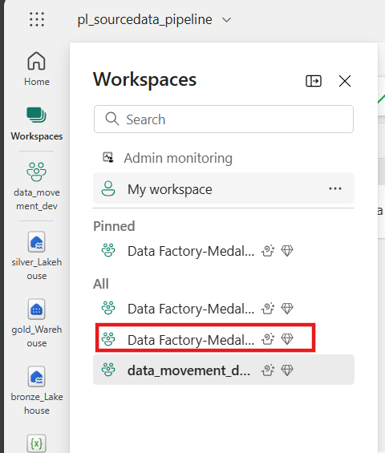

10. Select the silver_Lkaehouse to verify the table

> 

24. Now select the data_movement_variable

> 

13. In the *data_movement_dariable* select the **Test** stage.

14. On the test stage, click the **...** and select **Set as active**.

> 
>
> 

25. Click on the Save button

> 

26. Now, select data_movement_dev workspace

> 

15. Click on the pipeline

> 

16. Click on the canvas so that the focus is off of **Copy data**.

&nbsp;

27. On the canvas, select **Copy Data** so the focus is on **Copy
    Data**.

> 
>
> 
>
> 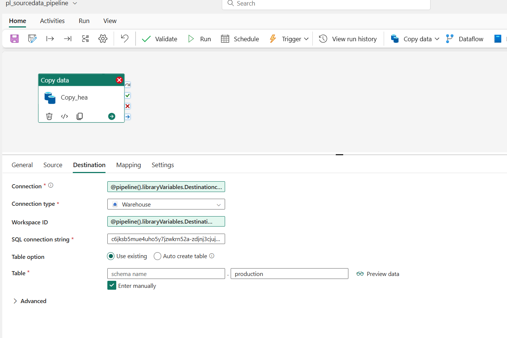

# Exercise 4: Implementing CI/CD and Git Integration for Dataflow Gen2 

This hands-on lab guides you through implementing CI/CD (Continuous
Integration and Continuous Deployment) for a Copy Job in Microsoft
Fabric Data Factory. You will learn how to build, export, and deploy
Data Factory pipelines using Git integration, deployment pipelines, and
workspace publishing. The lab emphasizes automating the movement of data
pipelines across development, test, and production environments—enabling
faster, more reliable data integration workflows.

## Prerequisites for Git integration

**Task-1: Create a GitHub account**

Complete the following steps to create a new **Github account** with the
same tenant credentials.

1.  Navigate to the GitHub with this link
    +++<https://github.com/+++> and click on **Sign up** to proceed
    further.

> 

2.  Now, To create a new GitHub account, enter
    the **email**, **password** and a unique **username** and click
    on **Continue** button.

> 

3.  Start the **verification** **puzzle** by following the instruction
    on the screen. Click on **Submit.**

4.  Enter the **verification** **code** you’ve received on your mail.

> 

5.  Now, with your credentials sign-in to GitHub and click on **Sign
    in.**

> 

6.  You have successfully created a new account on GitHub.

> 

## Task-1: Create a Repository in GitHub

1.  After successfully setting up GitHub account login to your account,
    click on **Create Repository** under create your first project.

> 

2.  After clicking **new repository** option, we will have to initialize
    some things like, **naming our repository**, choosing
    the **visibility, Add a README file** etc. After performing these
    steps click **Create Repository** button.

> 
>
> 

3.  After clicking the button, we will be directed to below page. Right
    now, the only file we have is a **readme** file.

> 

4.  To create a **new folder** in GitHub, you must first create a new
    file and add that file to your new folder at the same time. Do this
    by navigating to your **repository page**.

> Next, click the **Add file** dropdown menu on the right. Select the
> first option labelled "**Create new file."**
>
> 

5.  To create a folder, provide a name to
    this **folder** **(Copyjob-Test)** as follows. The folder name will
    automatically generate a new folder. Now you can give your **file a
    name** **(CJ-Contents).**  
    Type the **folder name followed by /** and hit Enter.

> 

6.  You'll need to **commit** your changes. Give a commit message
    and **select commit directly to the main branch** option. Click
    on **Commit changes**.

> 

## Task-2: Generate a fine-grained token with *read* and *write* permissions for Contents, under repository permissions

1.  Go to your **GitHub profile settings** and
    select **settings** option.

> 

2.  Navigate to **Developer settings**.

> 

3.  Select **Personal access tokens**, and Choose **Fine-grained
    tokens**. Click on **Generate new token.**

> 

4.  Provide a descriptive **name** and optional **description** for the
    token. Set an **expiration** **date** for the token. Choose
    the **resource owner** as your GitHub username.

> 

5.  Choose the **specific repository** that you have created
    as **Copyjob-Dev** you want the token to access.

> 

6.  **Specify Access Permissions:**

    - **Contents:** Select "Read and write" access for the "Contents"
      permission.

    - **Other Permissions:** You can also configure other permissions as
      needed, such as "Issues" or "Pull Requests".

> 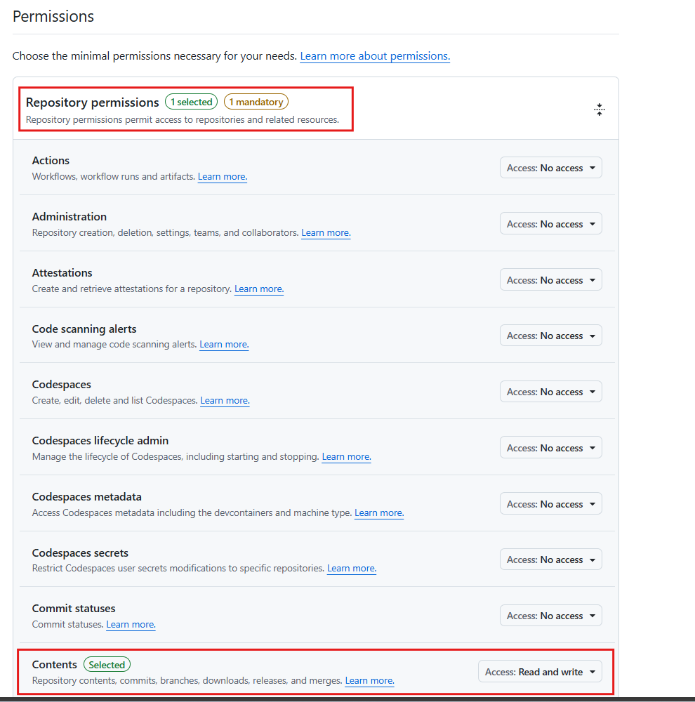
>
> 

7.  Click **Generate token.**

> 

8.  **Important:** \*\*Copy and securely store the generated token, as
    it will not be displayed again. \*\*

> 

## Task 3: Connect to a Git repository

To use Git integration with Copy job in Fabric, you first need to
connect to a Git repository, as described here.

1.  Sign-in into Fabric and navigate to any of the workspace you want to
    connect to Git. Select **Workspace settings**.

> 

2.  Select **Git integration**. Select your Git provider. Currently,
    Fabric only supports *Azure DevOps* or *GitHub*. If you use GitHub,
    you need to select **Add account** to connect your GitHub account.

> 

3.  In Add **GitHub account page**, provide a **display name** for your
    account. In **personal access token**, paste the
    copied **fine-grained token** that we have generated from the GitHub
    and at last, in **repository URL**, copy the url from the GitHub.
    Click on **Add**.

> 

4.  After you sign in, select **Connect** to allow Fabric to access your
    GitHub account.

> 

## Task 4: Connect to a workspace

> Once you connect to a Git repository, you need to connect to a
> workspace, as described here.

1.  From the dropdown menu, specify the following details about the
    branch you want to connect to:

    - **Branch**: Specify the branch as ***main***.

    - **Folder**: The GitHub folder name that we have created earlier as
      +++**Copyjob-Test**+++

> Select **Connect and sync**.
>
> 
>
> 

2.  After you connect, the Workspace displays information about **source
    control** that allows users to view the connected branch, the status
    of each item in the branch, and the time of the last sync.

> 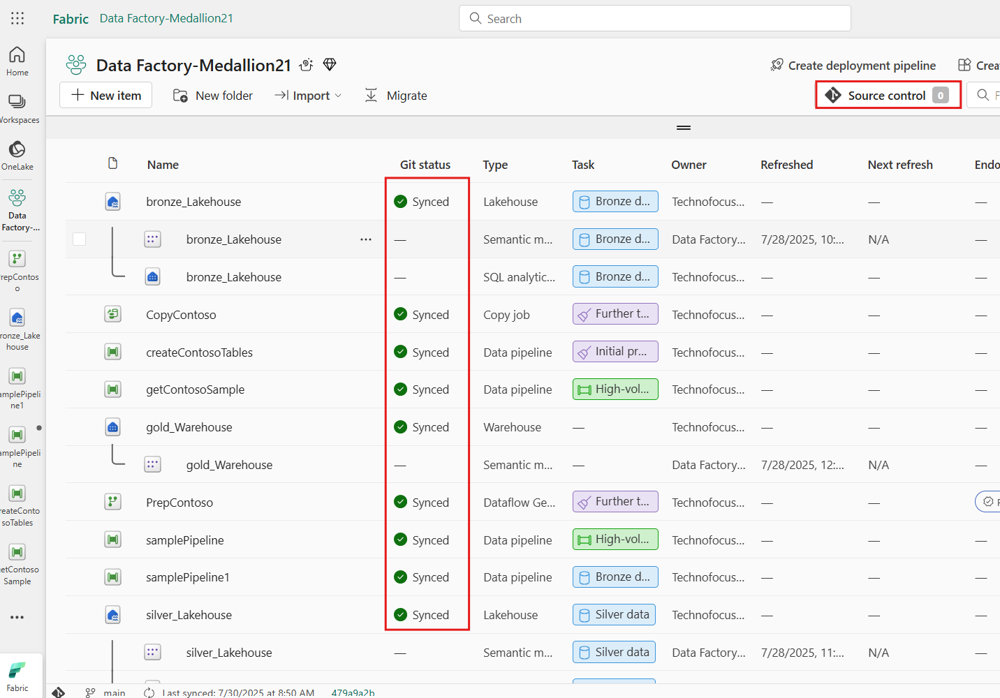

3.  You can also verify the committed changes in your GitHub repository
    to ensure all items have been pushed successfully

## Task 5: **Schedule a refresh**

If your dataflow needs to be refreshed on a regular interval, you can
schedule the refresh using the Fabric scheduler.

1.  In the Fabric workspace, select the more options ellipsis icon next
    to the dataflow and select the **Schedule**

> 

2.  Configure the schedule as required. The example here schedules the
    Dataflow to execute minutes at 15 minutes until the end of the year.

> 

3.  Click on the **close**

> 

4.  To check the status ellipsis icon next to the dataflow and select
    **Recent runs**

> 
>
> 
>
> 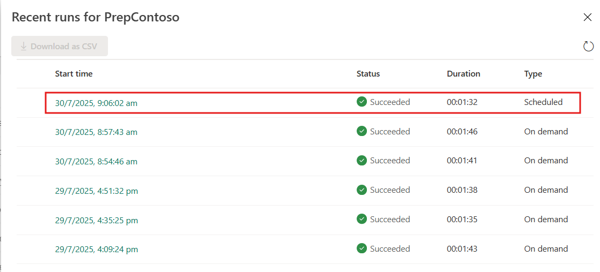

# Exercise 5: Setting Up Azure DevOps and Git Repository

> To use Microsoft Fabric’s CI/CD features, setting up an Azure DevOps
> project and a Git repository is essential. GitHub support was recently
> added, but that is a topic for another day. Here are some general
> steps to get started:

## Task 1: Creating the Repository

1.  Open your browser, navigate to the address bar, and type or paste
    the following URL: +++https://dev.azure.com/+++ then press the
    **Enter** button.

&nbsp;

2.  Select Sign in button

>  
>
> 

3.  In the **Microsoft Azure** window, enter your given credentials.

4.  In the **Azure portal** search bar, type **+++Azure DevOps+++** and
    click on the appeared **Azure DevOps organizations**.

> 

5.  In the Azure DevOps home page, select **My Azure DevOps
    Organization**

> 

6.  Select **Create new organization**

> 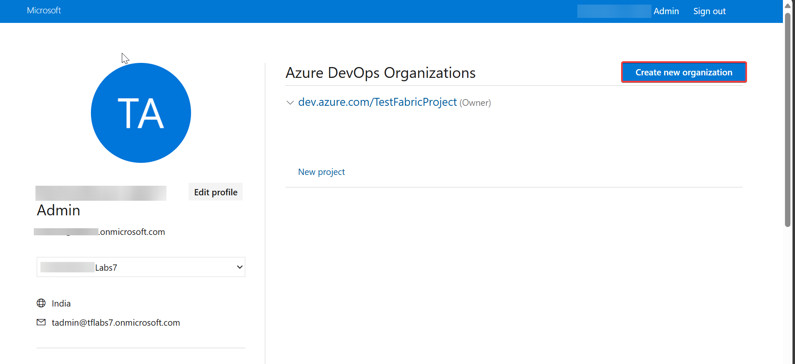

7.  In the Azure DevOps tab, click on the **Continue** button

> 

8.  Enter the Name your Azure DevOps organization and click on
    **Continue** button

> 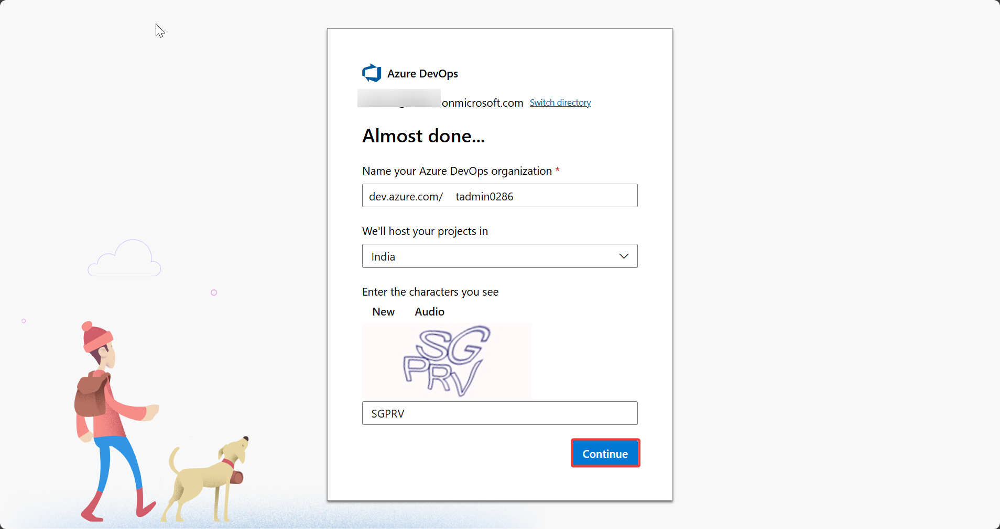

9.  In the Create a project to get started tab, enter the Project name
    as +++**DataFactory+**++ and click on **+ Create project** button

> 

10. To create a new repository in Azure DevOps, navigate to 'Repos' (1),
    then 'Files' (2), select the repository dropdown (3), and click on
    'New repository' (4)

> 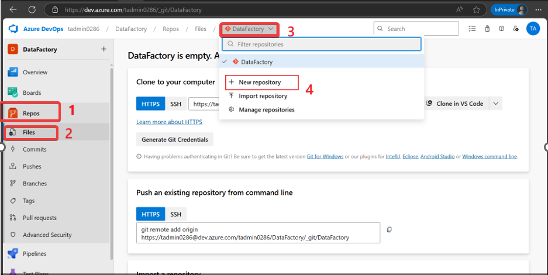

5.  In the Crate a repository tab, enter the Repository name as
    +++**DevOps-git**+++ and click on **Create** button.

> 
>
> 

6.  In the left-side navigation pane, navigate to **Repos** section,
    then click on **Branches**.

> 

7.  Click on **New branch**

> 

8.  In the **Create a branch** window, set the name to
    +++**Datafactory-devbranch**+++ and then select **Create**.

> 
>
> 

## Task 2: Integrating the Fabric feature workspace with the Azure Devops Repo

1.  Sign-in into Fabric and navigate to any of the workspace you want to
    connect to Git. Select **Workspace settings**.

> 

2.  Select **Git integration**. Select your Git provider. Currently,
    Fabric only supports *Azure DevOps* or *GitHub*. Select Azure DevOps
    and select **Add account** to connect your Azure DevOps account.

> 

3.  Select Azure DevOps your **Organization, Project, Git repository,
    Branch** and **Git folder**. Click on **Connect and Sync**

> 
>
> 
>
> 
>
> 

4.  In order for us to submit a pull request, we need to navigate to the
    **Source control** pane and then click on **View repository**.

> 

## Task 3: Merge Fabric Data Factory Changes to Main Branch

1.  Once your changes are pushed to the feature branch (e.g.,
    Datafactory-devbranch), click on **'Create a pull request'** to
    begin merging your Fabric Data Factory changes into the main branch.

> 

2.  Provide **a Title and Description** for the pull request summarizing
    your changes (e.g., 'Committing 1 item from workspace'), then click
    on 'Create' to initiate the merge into the main branch

> 
>
> 

3.  Click on the **Complete**

> 

4.  In the 'Complete pull request' window, ensure that 'Complete
    associated work items after merging' is selected, then click on
    'Complete merge' to finalize the integration into the main branch.

> 
>
> 

5.  Select the branch

> 
>
> 
>
> 

# Exercise 6: Get Started with deployment pipelines for Git

> The objective of this exercise is to help you understand how
> to **configure and use deployment pipelines with Git-enabled
> workspaces** in Microsoft Fabric Data Factory.
>
> In Microsoft Fabric, **deployment pipelines** and **Git sync** work
> together to streamline content management across environments. Git
> sync connects a workspace to an Azure DevOps repository, automatically
> saving and tracking changes. Deployment pipelines manage content flow
> through **Development**, **Test**, and **Production** stages. When
> each stage is Git-synced, updates are version-controlled and
> consistent across environments. Developers work in the Dev stage,
> changes are tested in the Test stage, and finalized content is
> promoted to Production—all while syncing with the Git repo.
>
> Before you get started, be sure to set up the following prerequisites:

- An active Microsoft Fabric subscription.

- Admin access of a Fabric workspace.

## Task-1: Create and name the deployment pipeline and assign stages

1.  From the **Workspaces** page, select **Create** **deployment
    pipeline**.

> 

2.  In the **Create deployment pipeline** dialog box, enter a name and
    description for the pipeline, and select **Next**.

> 

3.  Set your **deployment pipeline’s structure** by defining the
    required stages for your deployment pipeline. By default, the
    pipeline has three stages: *Development*, *Test*, and *Production*.
    We are keeping it **as it is** for now. Click on **Create and
    Continue**.

> 

## Task-2: Assign a workspace to the deployment pipeline

> After creating a pipeline, you need to add content you want to manage
> to the pipeline. Adding content to the pipeline is done by assigning a
> workspace to the pipeline stage. 

1.  In the stage you want to assign a workspace to, expand the dropdown
    titled **Add content to this stage** and select the workspace and
    click on the **tick** icon.

> 
>
> 

2.  While clicking on this tick icon, you might encounter this pop-up
    which says - **Workspace include unsupported items
    (Lakehouse).** Click on **Cancel.**

> 
>
> 

3.  To manage this, navigate to the **DataFactory-Fabric** workspace
    page. Beside the **lakehouse**, click on the **Share** option.

> 
>
> 

4.  Here, you need to grant the permission to access Lakehouse. Enter
    you **tenant name** and check all the boxes in **additional
    permissions**. Click on **Grant**.

> 
>
> 

5.  Now, navigate to the deployment
    pipeline **DataFactory-Pipeline** that you have created, again
    follow the step to **select the workspace** from the drop-down and
    click on the **tick** icon. All the resources are successfully
    deployed in development stage.

> 

## Task-3: Deploy to an empty stage

> When you finish working with content in one pipeline stage, you can
> deploy it to the next stage. Deployment pipelines offer three options
> for deploying your content:

- **Full deployment**: Deploy all your content to the target stage.

- **Selective deployment**: Select which content to deploy to the target
  stage.

- **Backward deployment**: Deploy content from a later stage to an
  earlier stage in the pipeline. Currently, backward deployment is only
  possible when the target stage is empty (has no workspace assigned to
  it).

> For this lab, we prefer **Full deployment**. You can
> consider **Selective deployment** by altering your stage items that
> needs to be deployed to the next stage.

1.  Select the **Test** stage and check the boxes you want to deploy to
    the test stage and click **Deploy** button which displays the number
    of resources to deployed.

> 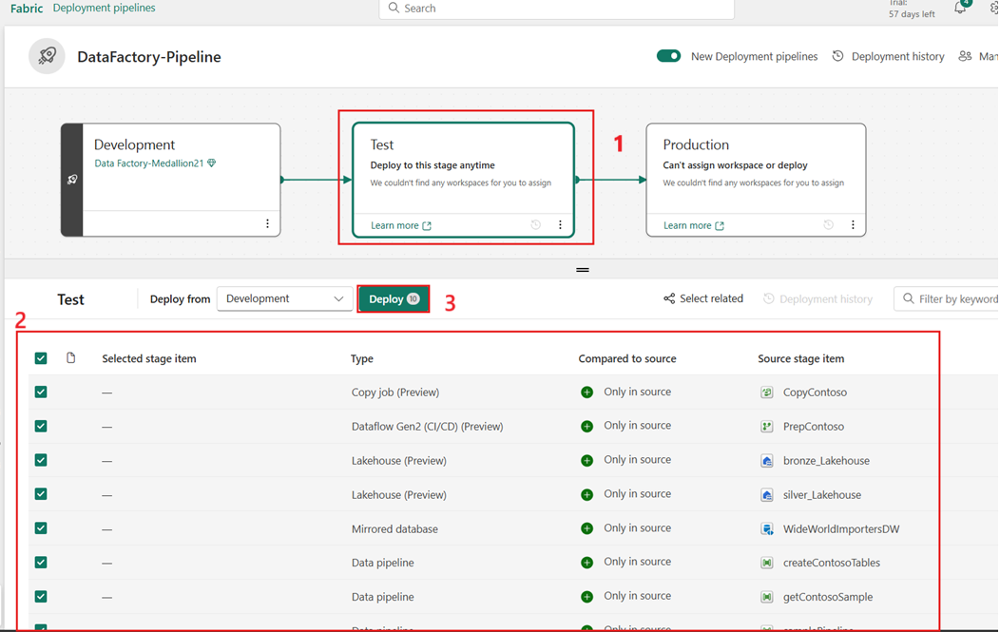

2.  Give a **confirmation** to deploy to the test stage by clicking
    on **Deploy** button.

> 

3.  You’ll see that all the stage items are successfully deployed
    in **Test** stage.

> 
>
> 

4.  Select the **Production** stage and check the boxes you want to
    deploy to the test stage and click **Deploy** button which displays
    the number of resources to deployed.

> 

5.  **Review and confirm** the deployment to the **production** stage by
    clicking on **Deploy** button. You can also add a note by
    expanding **Add a note** option.

> 

6.  You’ll see that all the stage items are successfully deployed
    in **Production** stage.

> 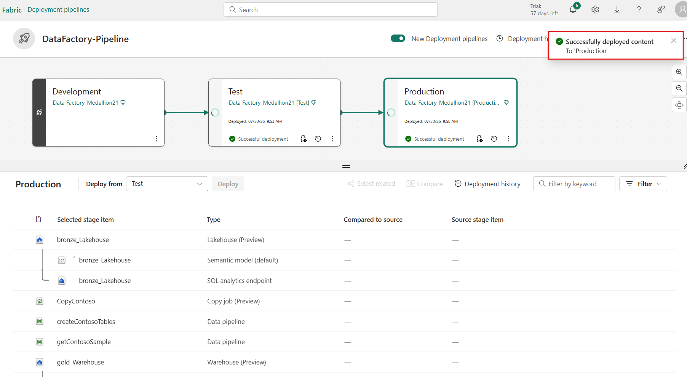
>
> 

## Task-4: Deploy content from one stage to another

1.  You can review the **deployment history** to see the last time
    content was deployed to each stage. To examine the differences
    between the two pipelines before you deploy, see and compare the
    content in different deployment stages. 

> 
>
> 
>
> 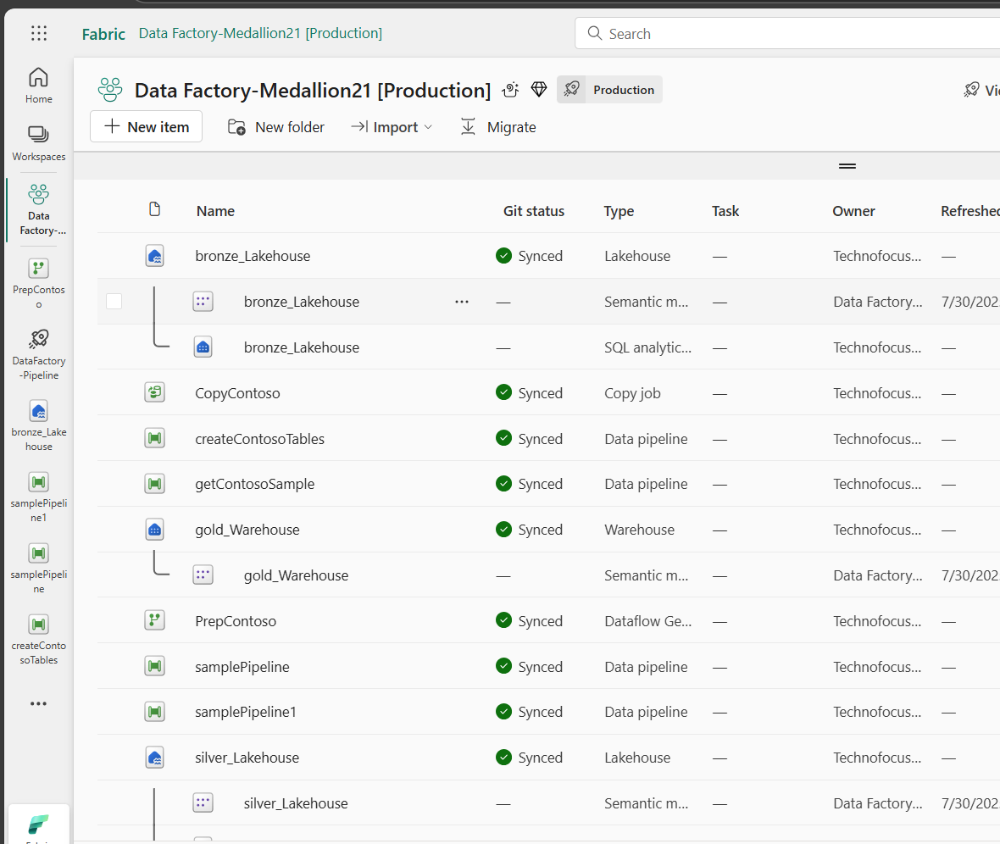
