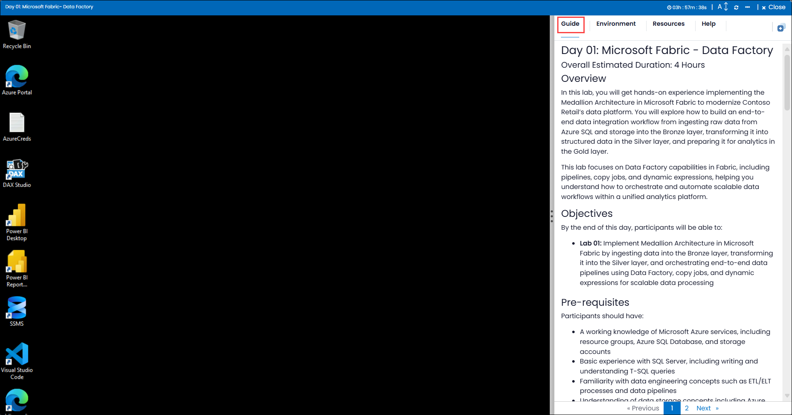
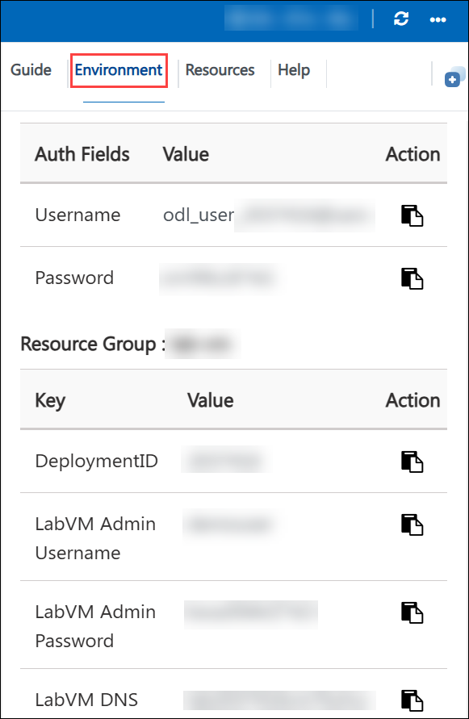
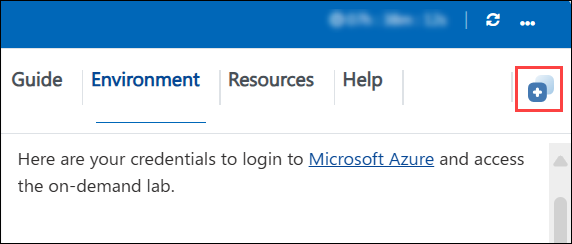
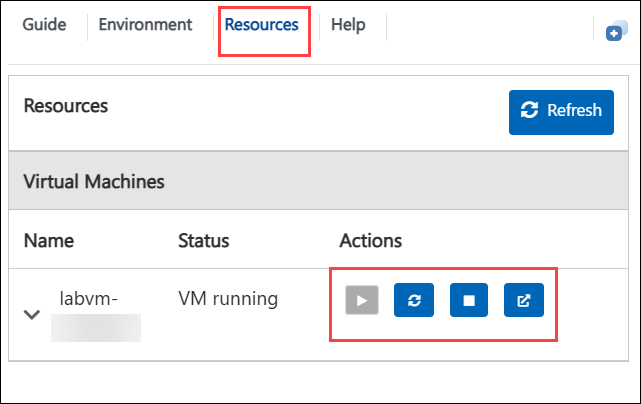
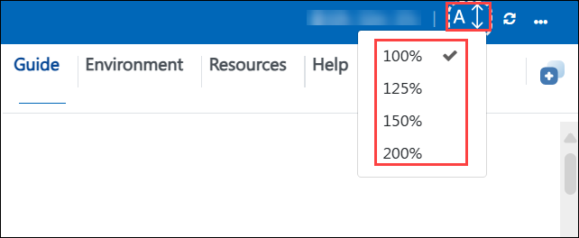
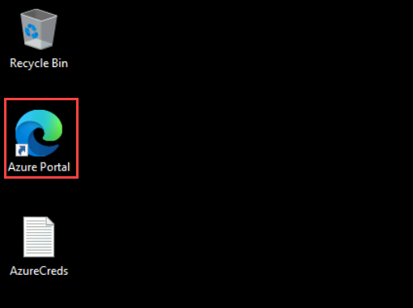
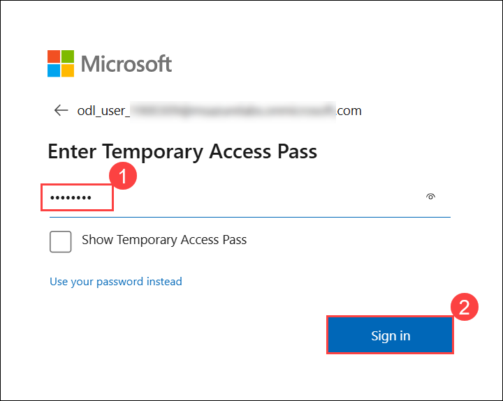
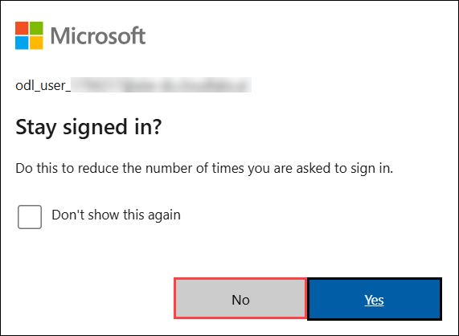
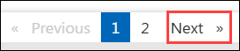

# Day 01: Microsoft Fabric - Data Factory

### Overall Estimated Duration: 4 Hours

## Overview

In this lab, you will get hands-on experience implementing the Medallion Architecture in Microsoft Fabric to modernize Contoso Retail’s data platform. You will explore how to build an end-to-end data integration workflow from ingesting raw data from Azure SQL and storage into the Bronze layer, transforming it into structured data in the Silver layer, and preparing it for analytics in the Gold layer.

This lab focuses on Data Factory capabilities in Fabric, including pipelines, copy jobs, and dynamic expressions, helping you understand how to orchestrate and automate scalable data workflows within a unified analytics platform. 

## Objectives

By the end of this day, participants will be able to:

- **Lab 01:** Implement Medallion Architecture in Microsoft Fabric by ingesting data into the Bronze layer, transforming it into the Silver layer, and orchestrating end-to-end data pipelines using Data Factory, copy jobs, and dynamic expressions for scalable data processing 

## Pre-requisites

Participants should have:

- A working knowledge of Microsoft Azure services, including resource groups, Azure SQL Database, and storage accounts
- Basic experience with SQL Server, including writing and understanding T-SQL queries
- Familiarity with data engineering concepts such as ETL/ELT processes and data pipelines
- Understanding of data storage concepts including Azure Data Lake Storage Gen2 and Microsoft Fabric Lakehouse
- General awareness of Medallion Architecture (Bronze, Silver, Gold layers) and modern data analytics workflows

## Explanation of Components

The architecture for this use case involves the following key components:

**Microsoft Fabric Data Factory:** The core data integration service providing:

- Pipelines for orchestrating end-to-end data workflows
- Copy jobs for efficient data ingestion at scale
- Dynamic expressions for flexible and parameterized data movement
- Integration with multiple data sources including Azure SQL and ADLS Gen2

**Azure SQL Database (Mirroring):** The primary structured data source providing:

- Transactional data from Contoso Retail systems
- Real-time data replication into Fabric using mirroring
- SQL-based querying and validation capabilities

**Azure Data Lake Storage Gen2 (ADLS Gen2):** The raw data storage layer providing:

- Scalable storage for unstructured and semi-structured data
- Hierarchical namespace for efficient data organization
- Integration with Fabric pipelines for ingestion and processing

**Microsoft Fabric Lakehouse:** The unified data storage layer providing:

- Bronze layer for storing raw ingested data
- Silver layer for structured and transformed data
- Built-in SQL analytics endpoint for querying and validation
- Seamless integration with OneLake for centralized storage

**Medallion Architecture:** The data design pattern enabling:

- Progressive data refinement across Bronze, Silver, and Gold layers
- Improved data quality, governance, and performance
- Scalable and modular data processing workflows

**Pipelines and Copy Activities:** The orchestration mechanism enabling:

- Automated ingestion from Azure SQL and ADLS Gen2
- Data transformation and movement between layers
- Scheduling, monitoring, and error handling for reliable execution

**Power BI and SQL Endpoint:** The analytics layer providing:

- Direct querying of curated data for reporting
- Integration with Fabric Lakehouse and Warehouse
- Business intelligence and visualization capabilities

## Getting Started with the Lab
 
Once the environment is provisioned, a virtual machine (LabVM) and lab guide will be loaded in your browser. Use this virtual machine throughout the workshop to perform the lab. You can see the number on the bottom of the Lab guide to switch to different exercises in the lab guide.
 
## Accessing Your Lab Environment
 
Once you're ready to dive in, your virtual machine and **Guide** will be right at your fingertips within your web browser.
 
   

### Virtual Machine & Lab Guide
 
Your virtual machine is your workhorse throughout the workshop. The lab guide is your roadmap to success.
 
## Exploring Your Lab Resources
 
To get a better understanding of your lab resources and credentials, navigate to the **Environment** tab.
 
   
 
## Utilizing the Split Window Feature
 
For convenience, you can open the lab guide in a separate window by selecting the **Split Window** button from the top right corner.
 

 
## Managing Your Virtual Machine
 
Feel free to start, stop, or restart your virtual machine as needed from the **Resources** tab. Your experience is in your hands!
 

## Lab Guide Zoom In/Zoom Out

To adjust the zoom level for the environment page, click the **A↕ : 100%** icon located next to the timer in the lab environment.

  
 
## Let's Get Started with Azure Portal
 
1. On your virtual machine, click on the **Azure Portal** icon.

    

1. On the **Sign in to Microsoft Azure** tab, you will see the login screen. Enter the following email/username, and click on **Next (2)**. 

    - **Email/Username**: <inject key="AzureAdUserEmail"></inject> **(1)**
   
      
     
1. Now enter the following Temparory Access Pass and click on **Sign in (2)**.
   
    - **Temporaray Access Pass**: <inject key="AzureAdUserPassword"></inject> **(1)**

      
     
1. If you see the pop-up **Stay Signed in?**, select **No**.

    

1. If you see the pop-up **You have free Azure Advisor recommendations!**, close the window to continue the lab.

1. If a **Welcome to Microsoft Azure** popup window appears, select **Maybe Later** to skip the tour.

## Support Contact

The CloudLabs support team is available 24/7, 365 days a year, via email and live chat to ensure seamless assistance at any time. We offer dedicated support channels tailored specifically for both learners and instructors, ensuring that all your needs are promptly and efficiently addressed.

Learner Support Contacts:

- Email Support: cloudlabs-support@spektrasystems.com
- Live Chat Support: https://cloudlabs.ai/labs-support

Now, click on **Next** from the lower right corner to move on to the next page.
 

## Happy Learning!!