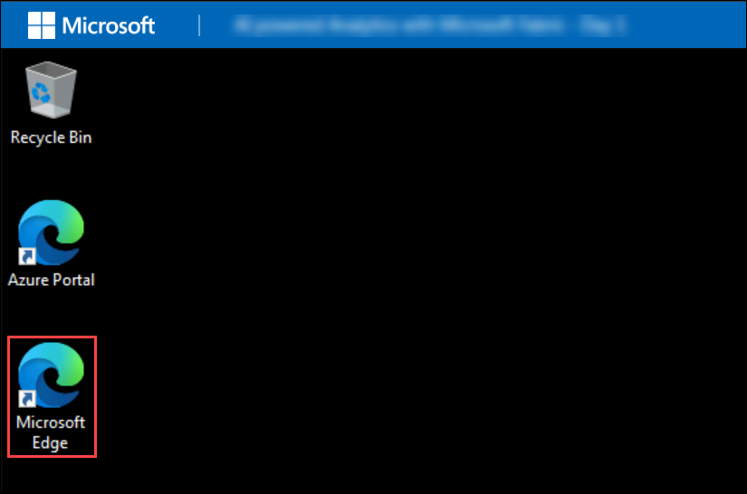
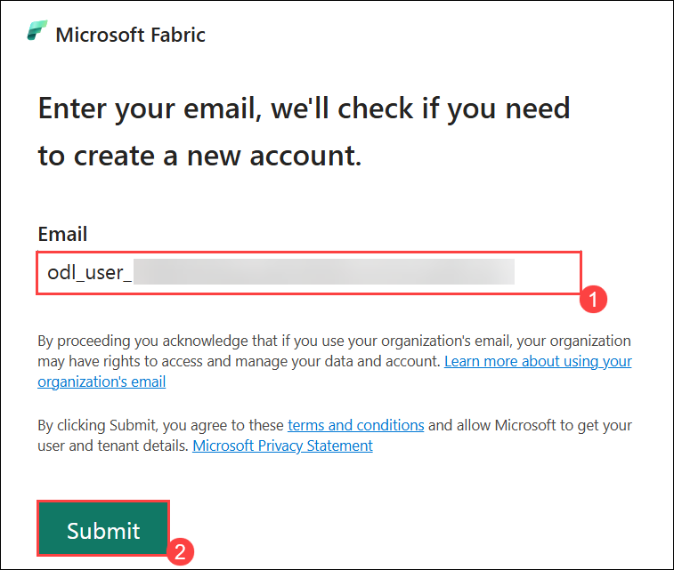
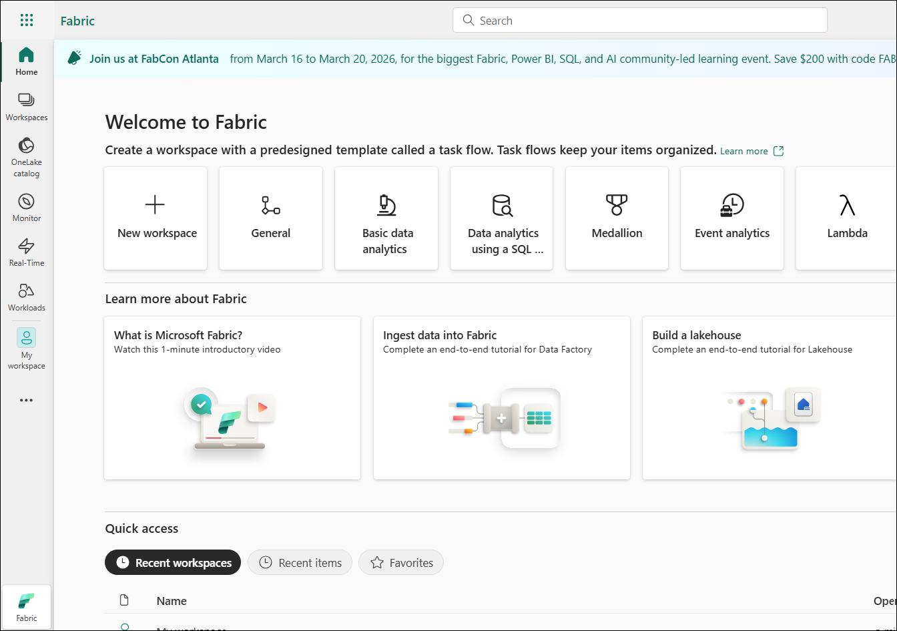

# Day 02: Microsoft Fabric - Data Factory

## Overall Estimated Duration: 4 Hours

### Overview

In this hands-on lab, you will gain comprehensive, hands-on experience in building an end-to-end **modern data engineering and integration solution using Microsoft Fabric Data Factory**. As organizations modernize their data platforms, Microsoft Fabric provides a unified and scalable environment that simplifies data ingestion, transformation, orchestration, and deployment within a single ecosystem.

Throughout this lab, you will create and configure a Fabric workspace, set up a Lakehouse, and ingest real-world datasets such as the **NYC Taxi dataset**. You will leverage **Dataflow Gen2 and Power Query** to clean, transform, merge, and enrich data, preparing it for downstream analytics. You will also implement advanced data transformation techniques such as filtering, aggregation, parameterization, and calculated columns to build a curated dataset.

Additionally, you will design and orchestrate data movement using Fabric Pipelines and Copy activities, enabling automated workflows between Lakehouse and Warehouse. The lab also introduces parameterized pipeline templates, scheduling, monitoring, and alerting mechanisms, ensuring reliability and operational efficiency. Finally, you will explore deployment-ready components such as reusable pipelines and automated refresh schedules, helping you build scalable, production-ready data solutions across environments. 

### Objectives

By the end of this lab, participants will be able to:

- Build an end-to-end data engineering solution in **Microsoft Fabric** by creating a workspace, Lakehouse, and ingesting sample datasets (NYC Taxi data)

- Perform data transformation and preparation using **Dataflow Gen2 and Power Query**, including cleaning, filtering, merging, aggregating, and parameterizing data

- Design and orchestrate data movement using **Fabric Pipelines and Copy activities**, including moving data from Lakehouse to Warehouse and monitoring execution

- Implement automation features such as **scheduled refresh, reusable pipeline templates, and basic monitoring**, to create scalable and production-ready data workflows


### Pre-requisites

Participants should have:

- A basic understanding of **Microsoft Fabric** concepts, including workspaces, Lakehouse, and Data Factory components

- Familiarity with **data integration and transformation concepts (ETL/ELT)**

- Basic knowledge of **Power Query** for data cleaning and transformation

- Understanding of **data storage concepts**, including Lakehouse and OneLake

- General awareness of **data pipelines, orchestration, and scheduling** in modern data platforms


### Explanation of Components

The architecture for this lab involves the following key components:

**Microsoft Fabric Workspace:** The central environment that hosts all artifacts including Lakehouse, Dataflows, Pipelines, and Warehouse. It acts as a unified container for managing and organizing data engineering assets.

**Fabric Lakehouse:** The primary data storage layer where raw and transformed data is stored. It combines the capabilities of a data lake and a data warehouse, enabling both file-based storage and table-based analytics using a SQL endpoint.

**OneLake:** Microsoft Fabric’s unified data lake that underpins the Lakehouse. It provides centralized, scalable storage for all data and ensures seamless integration across different Fabric components.

**Dataflow Gen2:** Used for data ingestion and transformation. It enables users to connect to data sources, clean and shape data using Power Query, and prepare curated datasets for analytics.

**Power Query:** The transformation engine within Dataflow Gen2 that allows users to perform operations such as filtering, merging, aggregating, and creating calculated columns to refine datasets.

**Fabric Pipelines:** Used for orchestrating and automating data workflows. Pipelines enable movement of data between Lakehouse and Warehouse, support scheduling, and allow integration of multiple activities.

**Copy Activity (Data Movement):** A core component within pipelines that facilitates data transfer between sources and destinations, such as moving curated data from Lakehouse to Warehouse.

**Fabric Data Warehouse:** A structured analytics layer where curated data is loaded for high-performance querying and reporting. It provides a SQL-based interface for downstream analytics and BI workloads.

**Parameterization and Scheduling:** These features enable dynamic and reusable data workflows. Parameters allow flexible data filtering and configuration, while scheduling ensures automated and consistent data refresh.

**Monitoring and Alerts:** Provides visibility into pipeline and dataflow execution, helping track performance, troubleshoot issues, and ensure reliable data operations.


## Getting Started with the Lab
 
Once the environment is provisioned, a virtual machine (LabVM) and lab guide will be loaded in your browser. Use this virtual machine throughout the workshop to perform the lab. You can see the number on the bottom of the Lab guide to switch to different exercises in the lab guide.
 
## Accessing Your Lab Environment
 
Once you're ready to dive in, your virtual machine and **Guide** will be right at your fingertips within your web browser.
 
   

### Virtual Machine & Lab Guide
 
Your virtual machine is your workhorse throughout the workshop. The lab guide is your roadmap to success.
 
## Exploring Your Lab Resources
 
To get a better understanding of your lab resources and credentials, navigate to the **Environment** tab.
 
   
 
## Utilizing the Split Window Feature
 
For convenience, you can open the lab guide in a separate window by selecting the **Split Window** button from the top right corner.
 

 
## Managing Your Virtual Machine
 
Feel free to start, stop, or restart your virtual machine as needed from the **Resources** tab. Your experience is in your hands!
 


## Lab Guide Zoom In/Zoom Out

To adjust the zoom level for the environment page, click the **A↕ : 100%** icon located next to the timer in the lab environment.

  
 
## Let's Get Started with Power BI Portal
 
1. On your virtual machine, open the **Microsoft Edge**.
 
    
 
2.  In the new tab, navigate to the **Microsoft Fabric** portal by copying and pasting the following URL into the address bar.

      ```
      https://app.fabric.microsoft.com
      ```

3. On the **Enter your email, we'll check if you need to create a new account** tab, you will see the login screen, in that enter the following email/username, and click on **Submit (2)**.

   - **Email/Username:** <inject key="AzureAdUserEmail"></inject> **(1)**
 
       
 
4. Next, provide your Temporary Access Password **(1)** and click on **Sign in (2)**:
 
   - **Temprory Access Pass:** <inject key="AzureAdUserPassword"></inject>
 
       

5. If you see the pop-up Stay Signed in?, select **No**.
   
    

6. On Microsoft Fabric (Free) license assignment dialog appears, click **OK** to proceed.

    

7. When the **Welcome to the Fabric view** dialog appears, click **Cancel**.   

    

8. You will be navigated to the **Microsoft Fabric Home page**.

    

## Support Contact

The CloudLabs support team is available 24/7, 365 days a year, via email and live chat to ensure seamless assistance at any time. We offer dedicated support channels tailored specifically for both learners and instructors, ensuring that all your needs are promptly and efficiently addressed.

Learner Support Contacts:

- Email Support: cloudlabs-support@spektrasystems.com
- Live Chat Support: https://cloudlabs.ai/labs-support

Now, click on **Next** from the lower right corner to move on to the next page.
 


## Happy Learning!!