# Use Case 2: Standalone Dataflow and Deployment Components

## Scenario: Contoso Retail

**Contoso Retail** is a multinational retail and distribution company
specializing in electronics, apparel, and home goods. With a vast
network of stores and a thriving e-commerce platform, Contoso generates
massive volumes of transactional, operational, and promotional data
every day.

Contoso decided to modernize its data platform using Microsoft Fabric’s
Data Factory capabilities. The company aimed to build a unified,
automated, and scalable solution using Dataflow Gen2, Pipelines, and
deployment components.

As part of its data platform modernization initiative, Contoso
identified the need to incorporate external urban mobility data to
enhance its location strategy, customer behavior analysis, and logistics
optimization. To achieve this, the company selected the NYC Taxi
dataset—a rich, publicly available dataset capturing millions of taxi
trips across New York City—as the core dataset for its pilot
implementation

You, as a Data Engineer at Contoso Retail, were tasked with setting up
the entire flow—from data ingestion and transformation, to monitoring,
parameterization, and automated deployment across multiple environments.
You collaborated with the solution architect to build a data
transformation solution with the following objectives.

- Ingest raw NYC Taxi data and discount files into a Lakehouse

- Transform and merge datasets using Dataflow Gen2 and Power Query

- Automate refreshes and orchestrate workflows using Pipelines and
  Airflow

- Enable dynamic deployments using Variable Libraries

- Integrate GitHub and Azure DevOps for CI/CD and version control

- Promote content across Dev, Test, and Prod using Deployment Pipelines

# Exercise 1: Dataflow Gen2 Using Sample Data

In this exercise, you begin by setting up the foundational data
architecture in Microsoft Fabric. You create a dedicated workspace and
lakehouse, ingest NYC Taxi datasets, and build Dataflow Gen2 to automate
data ingestion and transformation. You apply Power Query steps to clean,
filter, merge, and enrich the data, preparing it for downstream
analytics and reporting.

## Task 1: Create a Fabric workspace

In this task, you create a Fabric workspace. The workspace contains all
the items needed for this lakehouse tutorial, which includes lakehouse,
dataflows, Data Factory pipelines, notebooks, Power BI datasets, and
reports.

1. Open your browser, navigate to the address bar, and type or paste
    the following URL: **https://app.fabric.microsoft.com/** then
    press the **Enter** button.

2. On the **Microsoft Fabric** sign-in page, enter your credentials,
    and click on the **Submit** button.
    |   |   |
    |----|----|
    |Username|**@lab.CloudPortalCredential(User1).Username**|
    |TAP|**@lab.CloudPortalCredential(User1).AccessToken**|

    

3. Enter your password and click **Sign in**.

    

4. On **Stay signed in?** page, click **Yes**.

    

5. You'll be directed to Fabric Home page.

    

6. On the **Home** page click on **+ New Workspaces** as shown in the
    below image. This creates a dedicated workspace where you can
    organize all Fabric items.

    

7. On the **Create a workspace** pane that appears on the right side,
    enter the following details, and click **Apply**.

    |  |   |
    |----|----|
    |Name|	**Data Factory-@lab.LabInstance.Id**|
    |Advanced	|Select Fabric capacity|
    |Default storage format|	Small dataset storage format|


    

    

8. The Workspace is now created.

    

## Task 2: Create a lakehouse and Ingest sample data

In this task, you set up a lakehouse and ingest the NYC Taxi sample data
along with additional CSV files. This establishes your raw dataset
foundation inside Fabric, enabling you to start transformations and
queries later.

1. Create a new lakehouse by clicking on the **+New item** button in
    the navigation bar.

    

2. On the **Filter by item type** search box,
    enter **Lakehouse** and select the lakehouse item.

    

3. On the **New lakehouse** dialog box,
    enter **datafactory_lakehouse** in the **Name** field, click
    on the **Create** button and open the new lakehouse.

	**Note**: Ensure to remove space before **datafactory_lakehouse**.

    

    

4. Wait for the notification stating **Successfully created SQL
    endpoint**.

    

5. From the **lakehouse** home page, select **Start with sample data**
    to view the sample data list and load the lakehouse with the
    built-in sample dataset. Using sample data provides a quick starting
    point without needing raw data files.

    

6. The **Use a sample** dialog is displayed, select the **NYCTaxi**
    sample data tile.The NYCTaxi sample gives realistic,
    schema-consistent data, so you can focus on transformations rather
    than building data from scratch.

    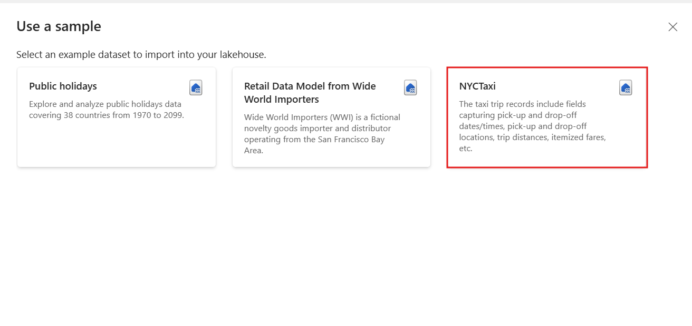

    

    

7. From the **Home** tab of the **Lakehouse,** select **Get
    data** **Upload files**.

    

5. On the **Upload files** pane that appears on the right side, select
    the **folder icon** under the **Files/** and then browse
    to **C:\LabFiles\Labfiles** and then select
    the **NYC-Taxi-Green-Discounts** file and click on
    the **Upload** button.

    

    

6. On the Upload folder pane, click **Upload**.

	>[!Alert] If the **Files** folder shows a failed state, wait a minute and refresh the browser.

    

7. After the files have been uploaded **close** the **Upload
    folder** pane.

    

8. Expand **Files** and select the **NYC-Taxi-Green-Discounts** file
    and verify that the CSV files have been uploaded.

    

9. On the **Lakehouse** page, under the Explorer pane, select
    **Files**. Now, hover your mouse
    to **NYC-Taxi-Green-Discounts.csv** file. Click on the horizontal
    ellipses **(…)** beside **NYC-Taxi-Green-Discounts**.csv. Navigate
    and click on **Load Table**, then select **New table**.

    

    

10. On the **Load file to new table** dialog box, and click on
    the **Load** button.

    

    

    

## Task 3: Create new Dataflow Gen2 with sample data

In this task, you build a new Dataflow Gen2 object that connects to the
lakehouse tables. Dataflows allow you to automate ingestion,
transformation, and preparation of data for downstream analytics.

1. From the left navigation select ***Data Factory-@lab.LabInstance.Id***, as shown in
    the image below.

    

    

2. Create a new Dataflow Gen2 by clicking on the **+New item** button
    in the navigation bar. From the list of available items select
    the **Dataflow Gen2** item

    

3. On the **New Dataflow Gen2** dialog box, click on **Dataflow1** and
    rename it to **NYC_Taxi_Dataflow**

    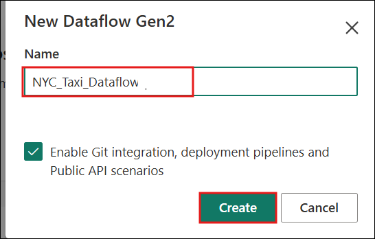

    

4. From the **Home** tab, select **Get data** and then
    the **More...** option to upload the tables into Dataflow Gen2

    

5. Within the **Get data** explorer's search bar,
    type **datafactory_lakehouse** to locate the lakehouse item.
    Select the **datafactory_lakehouse** item within the OneLake
    catalog's returned results.

    

6. Click on the **Connect** button.   

	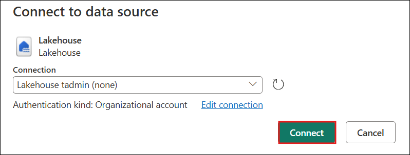

7. From the Get data table navigator, select the tables listed below to
    perform data transformation operations and merge the tables for our
    downstream business intelligence projects.

	- **green_tripdata_2022**

	- **nyc_taxi_green_discounts**

8. Click on **Create.**

    

    

## Task 4: Implement Power Query transformations

This task demonstrates how to clean and shape your dataset using Power
Query. You adjust data types, filter rows, unpivot columns, and
calculate new fields like discounts. These transformations prepare the
data for meaningful analysis.

1. Select the **green_tripdata_2022** table and from the **Home** tab,
    select the data type icon in the column header of the second column,
    **IpepPickupDatetime**, to display a dropdown menu and select the
    data type from the menu to convert the column from
    the **Date/Time** to **Date** type.

    

    

2. Select the **storeAndFwdFlag** column's filter and sort dropdown
    menu. (If you see a warning **List may be incomplete**,
    select **Load more** to see all the data.)

    

3. Select 'Y' to show only rows where a discount was applied, and then
    select **OK**.

    

    

4. Select the **IpepPickupDatetime** column sort and filter dropdown
    menu, then select **Date filters**, and choose
    the **Between...** filter provided for Date and Date/Time types

    

5. On the **Filter rows** dialog box, select dates between January 1,
    2022, and January 31, 2022, then select **OK**.

    

    

6. Select the **nyc_taxi_green_discounts** table and from the **Home**
     tab, while reviewing the data, we see the headers appear to be in
    the first row. Promote them to headers by selecting the table's
    context menu at the top left of the preview grid area to
    select **Use first row as headers**.

    

    

	**Note:** After promoting the headers, you can see a new step added to
	the **Applied steps** pane at the top of the dataflow editor to the data
	types of your columns.

7. Select the **nyc_taxi_green_discounts** table and from the **Home**
     tab .Right-click the **VendorID** column, and from the context menu
    displayed, select the option **Unpivot other columns**. This allows
    you to transform columns into attribute-value pairs, where columns
    become rows.

    

    

8. With the table unpivoted, rename the *Attribute* and *Value* columns
    using the formula bar. Replace the existing script with:  
	
	**Table.UnpivotOtherColumns(#"Changed column type", {"VendorID"}, "Date", "Discount")** 

    

    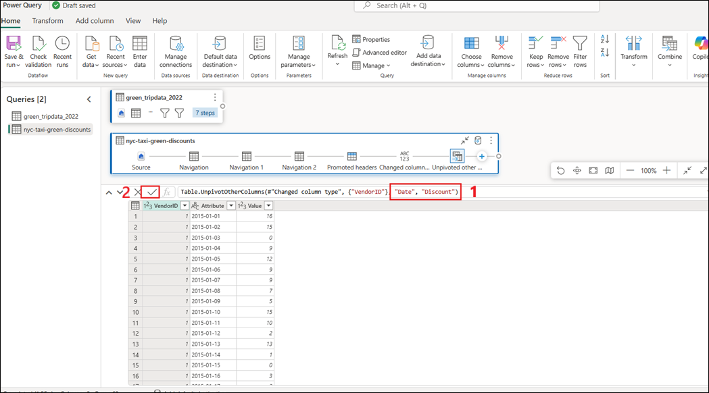

    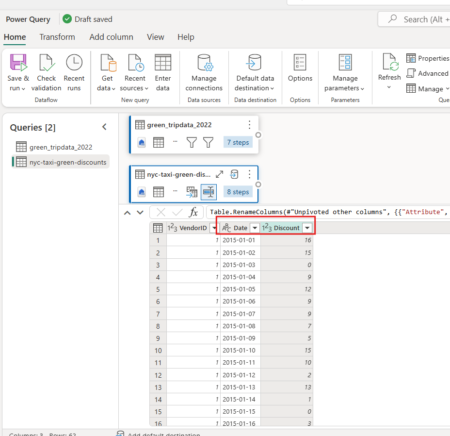

	**Note:** To rename the Attribute and Value columns, you can also
	double-click them and change 'Attribute' to 'Date' and 'Value' to
	'Discount'.

    

    

9. Change the data type of the Date column by selecting the data type
    menu to the left of the column name and choosing **Date**.

    

10. Select the **Discount** column and then select the **Transform** tab
    on the menu. Select **Number column**, and then
    select **Standard** numeric transformations from the submenu, and
    choose **Divide**.

    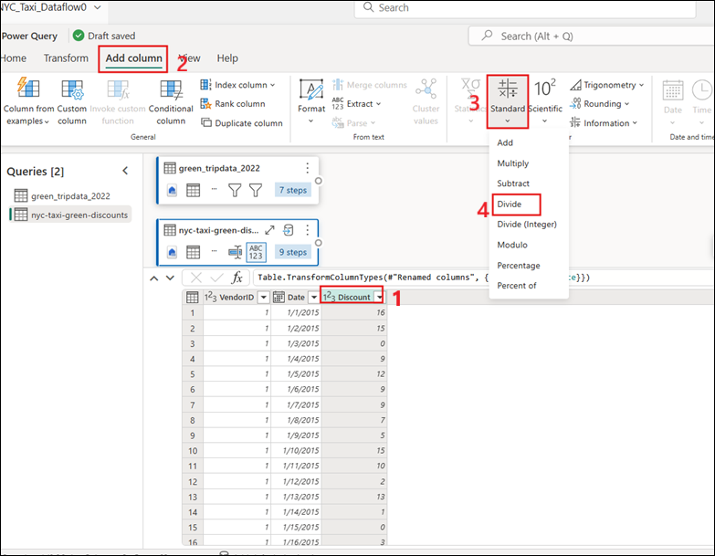

11. On the **Divide** dialog box, enter the value 100.

    

    

## Task 5: Merging queries

In this task, you join multiple tables (trip data and discounts) to
enrich your dataset. Merging helps consolidate related information into
a single unified view for reporting and analytics.

1. Select your original data query (In our example, its called Bronze),
    and on the **Home** tab, Select the **Combine** menu and
    choose **Merge queries**, then **Merge queries as new**.

    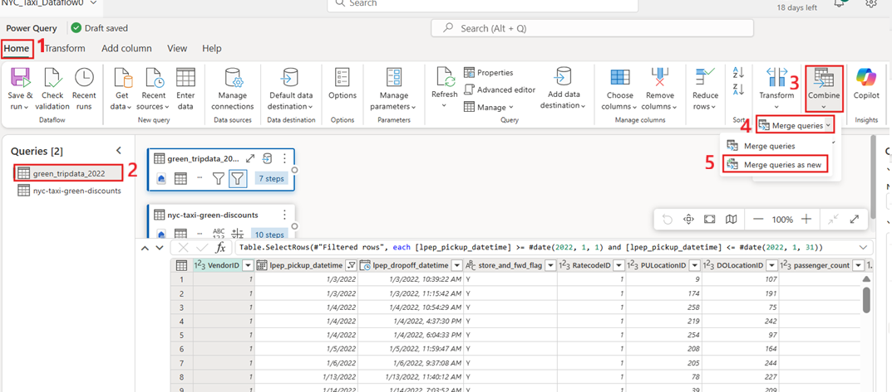

2. From the Merge query window, set the **Right table for
    merge** to **nyc-taxi-green-discounts**. On the top right corner,
    select the **lightbulb** which has detected a possible column match.
    In this example, both tables contain a column titled **VendorID**.
    Select this option to set the columns to be merged on. Click
    on **OK** to proceed. This activity ensures that the data is
    accurately combined based on matching columns.

    

    

    

3. Navigate to the far right of the **green_tripdata_2022** table.
    Select the expand icon on the joined **nyc_taxi_green_discounts**
    column. From the available column selections, deselect
    **VendorID**—since it was used as the merge key and already exists
    in the dataset—then click **OK** to continue.

    

    

4. With the discount value at the row level, we can create a new column
    to calculate the total amount after discount. To do so, select
    the **Add column** tab at the top of the editor, and choose **Custom
    column** from the **General** group.

    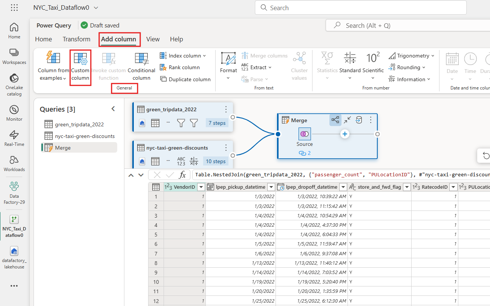

5. On the **Custom column** dialog, you can use the [Power Query
    formula language (also known as
    M)](https://learn.microsoft.com/en-us/powerquery-m) to define how
    your new column should be calculated.
    Enter **TotalAfterDiscount**** for the **New column name**,
    select **Currency** for the **Data type**, and provide the following
    M expression for the **Custom column formula**:

	**if [tolls_amount]  0 then [tolls_amount] * ( 1 - [Discount] ) else [tolls_amount]**

	Then select **OK**.

    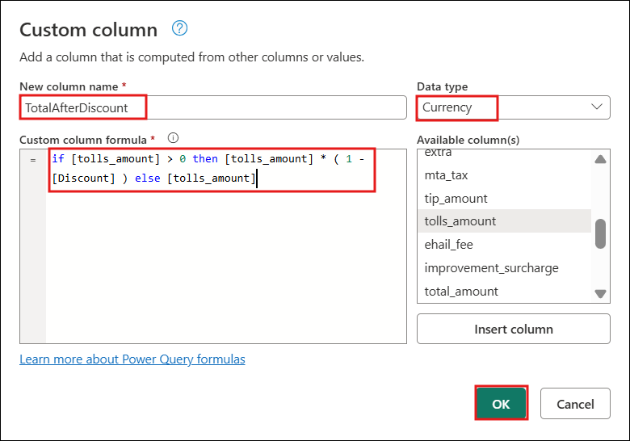

    

6. Select the newly created **TotalAfterDiscount** column and then
    select the **Add column** tab at the top of the editor window. On
    the **Number column** group, select the **Rounding** drop down and
    then choose **Round...**.

    

7. On the **Round** dialog box, enter 2 for the number of decimal
    places and then select **OK**.

    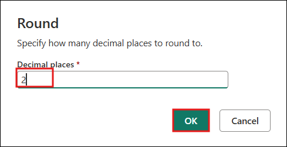

    

8. Change the data type of the **IpepPickupDatetime** from **Date** to
    **Date/Time**.

    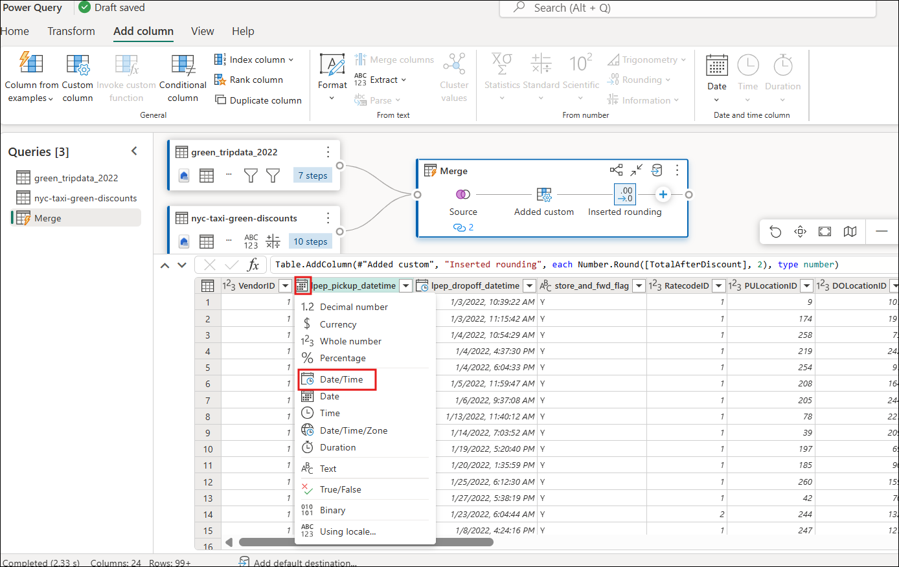

    

9. Finally, expand the **Query settings** pane from the right side of
    the editor if it isn't already expanded, and rename the query
    from **Merge** to **Output**.

    

## Task 6: Load the output query to a table in the Lakehouse

After transformations, you save the output query into the lakehouse as a
structured table. This provides a curated dataset ready for analytics or
reporting.

1. Select the **Output** merge query that has been created previously.
    Then select the **Home** tab on the editor window, and **Add data
    destination** from the **Query** grouping, to select
    a **Lakehouse** destination.

    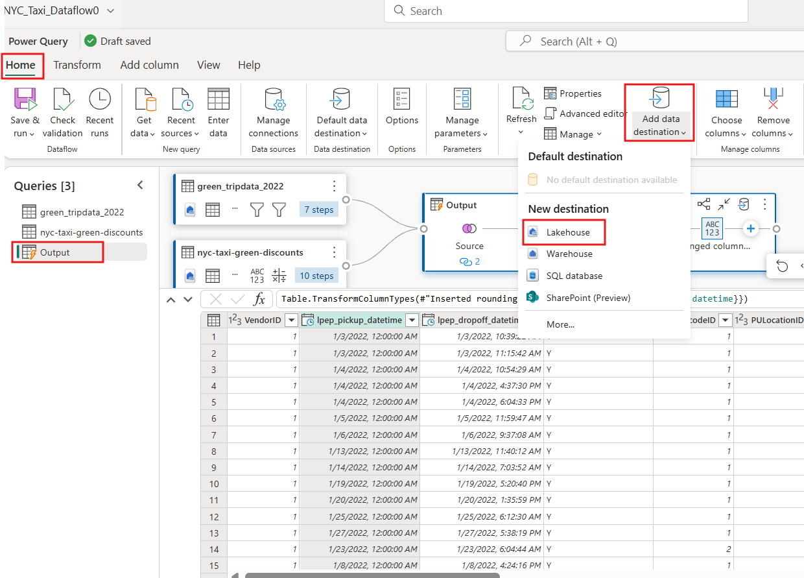

2. On the **Connect to data destination** dialog box, your connection
    should already be selected. Select **Next** to continue.

    

3. On the **Choose destination target** dialog, browse to the Lakehouse
    where you wish to load the data and name the new table, then
    select **Next** again.

    

4. On the **Choose destination settings** dialog, you can use the
    automatic settings or deselect the automatic settings and leave the
    default **Replace** update method, double check that your columns
    are mapped correctly, and select **Save settings**.

    

5. On the main editor window, confirm that you see your output
    destination on the **Query settings** pane for the **Output** table
    under **Data destination**, and then select **Save**\*.

    

## Task 7: Choose columns

In this task, you refine your dataset by selecting only the necessary
columns. This improves performance, reduces clutter, and ensures
downstream reports focus only on relevant data.

1. On the Home tab, go to the **Output** table, and in the Manage
    columns group, select **Choose columns**

    

2. The **Choose columns** dialog appears, containing all the available
    columns in your table. You can select all the fields that you want
    to keep and remove specific fields by clearing their associated
    check box. For this example, you want to remove
    the **GUID** and **Report created by** columns, so you clear the
    check boxes for those fields.

    

3. After selecting **OK**, create a table that only contains
    the selected columns.

    

## Task 8: Remove columns

In this task, you remove unnecessary columns using different techniques.
This ensures the final dataset remains lean and tailored for business
needs.

1. When you select **Remove columns** from the **Home** tab, you have
    two options:

	- **Remove columns**: Removes the selected columns.

	- **Remove other columns**: Removes all columns from the
	  table *except* the selected ones.

    

2. You can also select the columns you want to remove in the table,
    then select and hold (or right-click) the column and choose **Remove
    columns** in the shortcut menu. This method of removing columns is
    demonstrated in the next section.

	**Remove selected columns**

	Starting from the sample table, select the **passenger_count** and
	the **Report created** columns. Select and hold (or right-click)
	either of the selected column headings. A new shortcut menu appears,
	where you can select the **Remove columns** command.

    

3. After selecting **Remove columns**, you create a table that only
    contains the columns.

    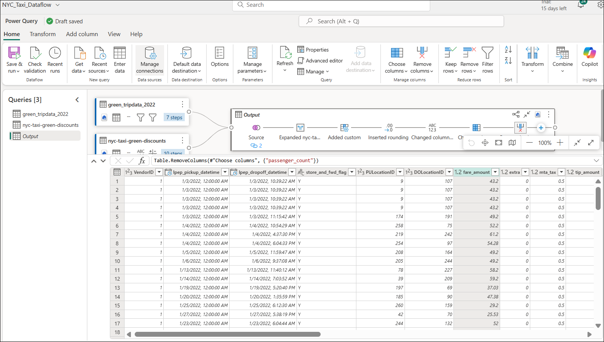

## Task 9: Group and Aggregate Data by Column(s) in Power Query

In this task, you aggregate data by VendorID, pickup time, and fare
amount. Grouping and aggregation generate summarized insights that can
answer key business questions like total tips per vendor.

1. Select **Output** and select **Group by** on the **Home** tab.

    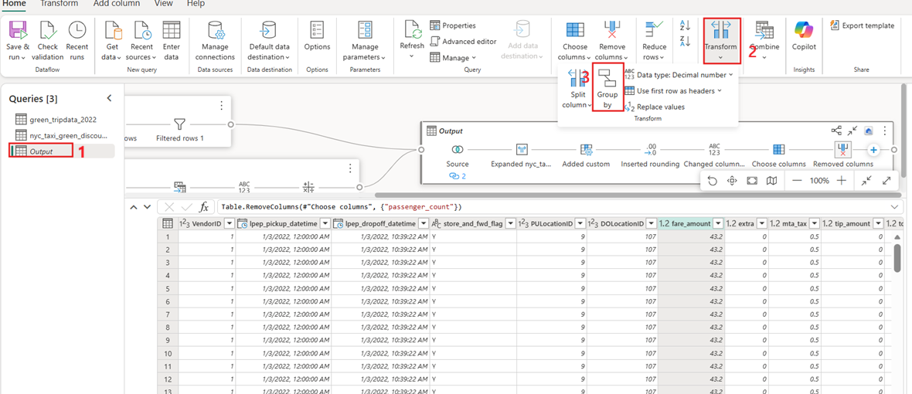

2. On the **Group by** settings page, enter the following details.

	- Select **Advanced** radio button.

	- Under **Group by** select the following:

		1. **VenderID**

		2. **Ipep_pickup_datetime**

		3. **Fare_amount**

3. On the **New column name,** enter
    **Count** in **Operation** column field, select **Sum**, then
    under **Column** field, select **tip_amount.** Click on **Add
    aggregation** to add more aggregate column and operation.

4. On the **New column name,** enter
    **File** in **Operation** column field, select **Sum**, then
    under **Column** field, select **Source_file**. Click on **Add
    aggregation** to add more aggregate column and operation.

5. Click **OK** 

    

    

    

## Task 10: Creating a Parameter and Using It in a Filter

This task introduces parameterization in Power Query. By creating
dynamic filters (e.g., PUlocationID), you make your transformations
flexible and reusable across environments or scenario

1. On the Home tab, select **green_tripdata_2022**

2. On the **Power Query Home** tab, select **Manage Parameters**, then
    choose **New Parameter.**

    

3. On the **Manage Parameters** dialog, enter the following details:
    set **the Name to **PUlocationID**, the **Type to Decimal
    Number**, and the **Current Value to 74**, then click **OK** to save
    the parameter**.**

    

    

4. Select the **green_tridata_2022** query and from the **Home** tab


5. Select the **PUlocationID** column sort and filter dropdown menu,
    then select **Number filters**, and choose the **Equals...** 

    

6. On the **Filter rows** dialog, click the pencil icon next to the
    value field, then select **Select a parameter** to dynamically
    filter rows based on a predefined parameter.

    

7. Choose the parameter **PUlocationID** from the dropdown list to
    filter rows dynamically based on the selected parameter value. Click
    on **Ok** button

    

8. This will filter the **PUloactionID** table to only show the product
    with the key you specify.

    

9. To modify the parameters, select the **PUloactionID** parameter,
    enter **244** as the Current Value, and then click the **Apply**
    button

    

    

11. On the Query settings pane, select the **green_tripdata_2022**

12. Select the **Productkey** column sort and filter dropdown menu, then
    select **Number filters**, and choose the **Greater than...** 

    

13. In the **Filter rows** dialog, click the pencil icon next to the
    value field, then click **Select a parameter** and select it. Click
    **Ok**

    

    

14. On the Home window, select **Save & run** and click on **Save & run** button

    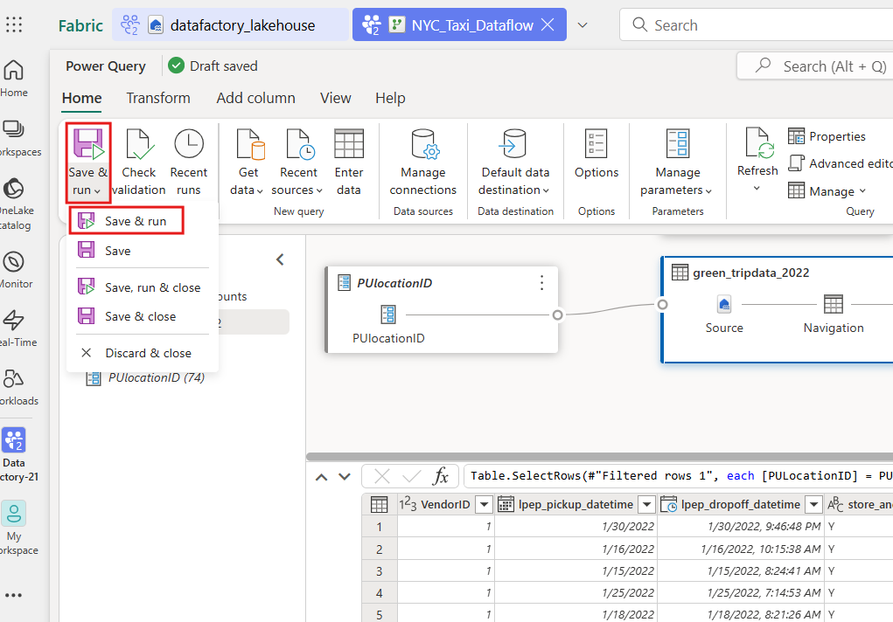

    

15. On the left navigation select ***Data Factory-@lab.LabInstance.Id***, as shown in the
    image below.


**Optional: Link Parameters to Other Queries**

You can use the same parameter to filter related tables like:

- nyc_taxi_green_discount

This helps create **interactive reports** where users can select a
product and see related sales or category data.

## Task 11: Schedule a refresh

Finally, you automate the refresh of your dataflow on a recurring
schedule. This ensures your curated datasets remain updated without
manual intervention.

1. On the Fabric workspace, select the more options ellipsis icon next
    to the dataflow and select the **Schedule**

    

2. Configure **the Dataflow refresh schedule to run once daily at 8:00
    AM until the end of the year.** This frequency is more typical for
    production environments, balancing data freshness with system
    performance and resource efficiency.

    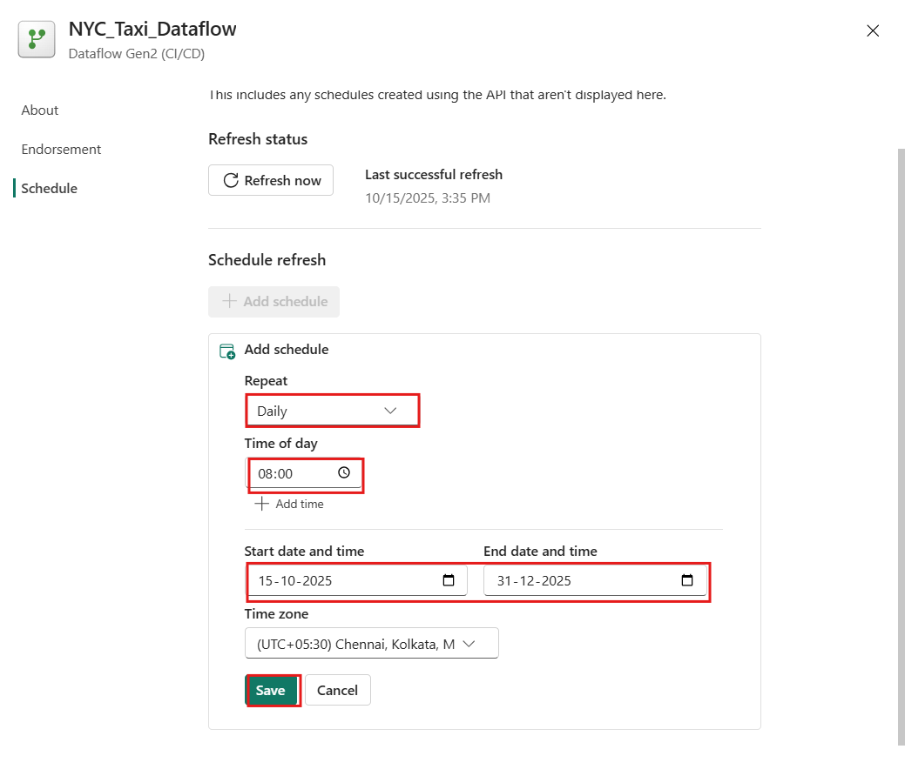

3. Select **Close**

    

4. To check the status ellipsis icon next to the dataflow and select
    **Recent runs**

    

    

	**Note:** You can view the **Recent runs** directly within the
	Dataflow editor—located just after the **Save and run** and **Check
	validation** options. This allows you to monitor execution history
	without leaving the Dataflow interface

    

    

# Exercise 2: Pipeline Templates and Monitoring 

In this exercise, you design and orchestrate data movement using Fabric
Pipelines. You configure copy jobs to move curated data from lakehouse
to warehouse, integrate Apache Airflow for workflow automation, and
build parameterized pipeline templates for reusability. You also monitor
pipeline executions to ensure reliability, performance, and
traceability.

## Task 1: Copy job into the warehouse

You configure a copy job to move tables from the lakehouse into a
dedicated warehouse. This step demonstrates how to stage curated data
into a high-performance environment for analytics.

1. On **Data Factory-@lab.LabInstance.Id** workspace page, navigate and click on **+ New item** button and select the **Warehouse** tile.

    

2. On the **New warehouse** dialog box,
    enter **dataFactory_warehouse** in the **Name** field, click
    on the **Create** button and open the new lakehouse.

    

    

3. On the left navigation, select ***Data Factory-@lab.LabInstance.Id***, as shown in
    the image below.

    

4. On workspace page, click **New item** and select the **Copyjob**
    tile.

    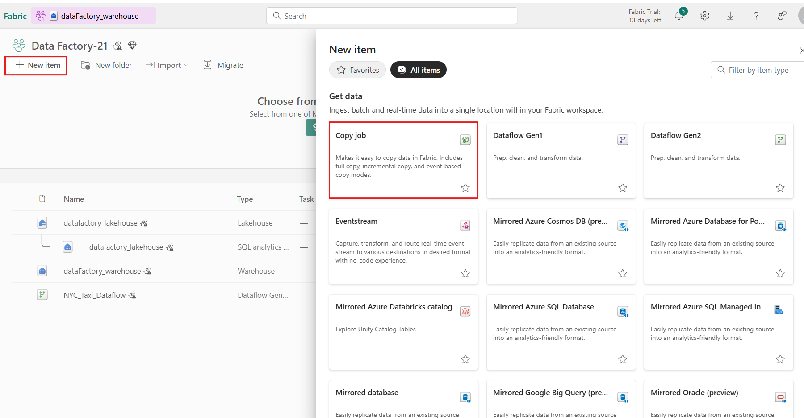

3. On the New copy job window, set the copy job name
    to **CopyNYCTaxi** and then select **Create**.

    

4. From the Copy job window, use the OneLake tab at the top if you want
    to set additional criteria such as filters or item types. Select
    **datafactory_lakehouse**

    

5. Now that you're on the **Choose data** step, select the following
    tables:

	- green_tripdata_2017

	- green_tripdata_2019

	- nyc_taxi_green_discount

    

6. On the Choose data destination tab, search for the data source
    starting with **datafactory_warehouse** in the search bar and
    then select **datafactory_warehouse** from the OneLake catalog list.

    

7. On the **Settings** step, review the Copy job mode options and then
    select **Next** to continue. Copy jobs move curated data into a
    warehouse for faster analytics.

    

8. On the **Map to destination** tab, you can review the added tables
    and update the schema or table names. Once reviewed,
    select **Next** to continue.

    

9. On the **Review + save** step, deselect the **Start data transfer
    immediately** option and then select **Save** to continue.

    

    

10. Now that you've reviewed the configuration, from the **Home** tab,
    select the **Run** option to begin copying data from the lakehouse
    into the warehouse.

    

    

11. You can monitor the copy job in the **Results** tab at the bottom to
    confirm that it has successfully completed.

    

12. Hover over the copy job on the left side-rail and select
    the **X** to close it.

13. On the top menu, select **datafactory_warehouse**, as shown in the
    image below.

    

14. To verify the tables in the warehouse, navigate to the warehouse
    explorer and review the list of tables

    

15. On the left navigation, select **Data Factory-@lab.LabInstance.Id**, as shown in the
    image below.

    

## Task 2: Create parameterized pipeline template

In this task, you design a reusable pipeline template with parameters.
Parameterization makes pipelines flexible and reusable across multiple
datasets, environments, or scenarios.

1. Select the **New item** option on the workspace page.
    Select **Pipeline** from the new item flyout menu.

    

2. Provide a Pipeline Name as **sample_pipeline** and then
    select **Create**.

    

## Task 3: Use a Copy activity in the pipeline to load sample data to a data Lakehouse

In this task you configure a pipeline activity of moving and
transforming a sample data (Public Holidays dataset) into a lakehouse.

1. From the **sample_pipeline**  pipeline page, drop down the **Copy
    data** and select the **Add to canvas** to copy the sample data.

    

2. The properties section below provides access to the configurations
    for Source, Destination, Settings, and more. These configurations
    can be edited directly to ensure the data copy activity is correctly
    set up and aligned with specific requirements.

    

3. Click the **Source** tab, open the **Connection** drop-down menu,
    and select **Browse all**.

    

4. You will be landed on the **Copy data** page. On the **Choose data
    source** tab, select **Sample data** section and then select
    the **Public Holidays** data source type.

    

5. A preview of the data source will now be displayed to verify the
    correct selection and understand the data structure. After reviewing
    the preview, select **OK** to proceed.

    

6. Select the **Destination** tab

    

7. In the **Destination** tab, open the **Connection** drop-down menu,
    and select **Browse all**.

    

8. Select the **datafactory_lakehouse** lakehouse item as the data
    destination from the **OneLake catalog list**. It determines the
    storage location for the data

    

9. On the **Destination** tab of the **Copy data** activity, click
    **+New** to create a new destination table for loading the data.   

10. Enter the table name as **holidaydatacontainer** and click on
    **Create**

    

**Task 5: Run and view the results of your Copy activity.**

1. Select the **Run** option to start the pipeline and begin your data
    ingestion process. Running the pipeline initiates the data transfer
    from the source to the destination.

    

2. On the **Save and run?** dialog box, click **Save and run** to
    execute these activities. This activity will take less than 1 min.

    

    

    

3. You can monitor the run and check the results on the **Output** tab
    below the pipeline canvas. Select the **activity name** to view the
    run details.

    

4. The run details show rows Data read and Data written.

    

5. Expand the **Duration breakdown** section to see the duration of
    each stage of the Copy activity. After reviewing the copy details,
    select **Close**.

    

3. Select the **Activities** tab in the pipeline editor and find
    the **Office Outlook** activity.

    

4. Select and drag the **On success path** (a green checkbox on the top
    right side of the activity in the pipeline canvas) from your Copy
    activity to your new Office 365 Outlook activity.

    

5. Select the Office 365 Outlook activity from the pipeline canvas,
    then select the **Settings** tab of the property area below the
    canvas to configure the email. Click on **Connection** dropdown and
    select **Browse all.**

    

6. On ‘choose a data source’ window, select **Office 365 Email**
    source.

    

7. Sign in with the account from which you want to send the email. You
    can use the existing connection with the already signed in account.

    

    

8. Click on **Connect** to proceed.

    

9. Select the Office 365 Outlook activity from the pipeline canvas, on
    the **Settings** tab of the property area below the canvas to
    configure the email.

    - Enter your email address in the **To** section. If you want to use
    several addresses, use **;** to separate them.

    

	- For the **Subject**, select the field so that the **Add dynamic
	  content** option appears, and then select it to display the pipeline
	  expression builder canvas.

10. The **Pipeline expression builder** dialog appears. Enter the
    following expression, then select **OK**:

	**@concat('DI in an Hour Pipeline Succeeded with Pipeline Run Id',pipeline().RunId)**

    

11. For the **Body**, select the field again and choose the **View in
    expression builder** option when it appears below the text area. Add
    the following expression again in the **Pipeline expression
    builder** dialog that appears, then select **OK**:

	**@concat('RunID = ', pipeline().RunId, ' ; ', 'Copied rows ',
	activity('Copy_data1').output.rowsCopied, ' ; ','Throughput ',
	activity('Copy_data1').output.throughput)**

	**Note:** Replace **Copy_data1** with the name of your own
	pipeline copy activity (example: **Copy_2ph**).

    

    

6. Finally select the **Home** tab at the top of the pipeline editor
    and choose **Run**. Then select **Save and run** on the confirmation
    dialog to execute these activities.

    

    

12. After the pipeline runs successfully, check your email to find the
    confirmation email sent from the pipeline.

    

    

## Task 4: Schedule pipeline execution

In this task, you automate pipeline execution with a schedule. Scheduled
runs help ensure data freshness without manual effort

1. On the **Home** tab of the pipeline editor window,
    select **Schedule**.

    

2. Select **+ Add schedule** and configure the schedule as required
    then select **Save** and close the **Schedule** panel.

	**Note**: The example here schedules the pipeline to execute
	daily at 8:00 PM until the end of the year.

    

    

    

## Task 5: Add a Dataflow activity to the pipeline

In this task, you integrate a Dataflow into your pipeline, chaining
activities together. This creates end-to-end workflows where multiple
data processing steps are executed in sequence.

1. Hover over the green line connecting the **Copy activity** and
    the **Office 365 Outlook** activity on your pipeline canvas and
    select the **+** button to insert a new activity.

    

2. Choose **Dataflow** from the menu that appears.

    

3. The newly created Dataflow activity is inserted between the Copy
    activity and the Office 365 Outlook activity, and selected
    automatically, showing its properties in the area below the canvas.
    Select the **Settings** tab on the properties area, and then select
    your dataflow created.

    

13. Select the **Home** tab at the top of the pipeline editor and
    choose **Run**. Then select **Save and run** again on the
    confirmation dialog to execute these activities.

    

    

    

14. Select your workspace,
    the [**Data-Factory@lab.LabInstance.Id**](mailto:Data-Factory@lab.LabInstance.Id) from
    the left-hand navigation menu. It opens the workspace item view.

    

## Task 6: Monitor data pipeline runs

In this task, you monitor the data pipeline runs.

1. To monitor your data pipeline runs, hover over your pipeline in your
    workspace. Doing so brings up three dots to the right of your
    pipeline name.

2. Select the three dots to find a list of options. Then
    select **Recent runs**. This action opens a fly-out on the right
    side of your screen with all your recent runs and run statuses.

    

    

3. Select **Go to monitoring hub** from the prior screenshot to view
    more details and filter results. Use the filter to find specific
    data pipeline runs based on several criteria.

    

    

4. Select one of your pipelines runs to view detailed information.
    You're able to view what your pipeline looks like and view more
    properties like Run ID or errors if your pipeline run failed.

    

    

5. If you have greater than 2000 activity runs in your pipelines,
    select **Load more** to see more results in the same monitoring
    page.

    

    

6. Use the **Filter** to filter by activity status or **Column
    Options** to edit the columns viewed in the monitoring view.

    

    

15. Select the column option and select the columns and click on
    **Apply** button

    

    

16. Select the **sample_pipeline**

    

    

17. You can also search for an activity name, activity type, or activity
    run ID with the **Filter by keyword** box.

    

    

    

7. If you want to export your monitoring data, select **Export to
    CSV**.

    

    

8. To find additional information on your pipeline
    runs **Input** and **Output**, select the input or output links to
    the right of the relevant row in the Activity Runs.

    

9. You can select **Update pipeline** to make changes to your pipeline
    from this screen. This selection takes you back to the pipeline
    canvas.

    

10. You can also **Rerun** your data pipeline. You can choose to rerun
    the entire pipeline or only rerun the pipeline from the failed
    activity.

    

18. Select the **Rerun entire data pipeline**

    

19. Select **Ok**

    

    

    

# Exercise 3: Implementing CI/CD and ALM Solution Architectures for Dataflow Gen2 in Microsoft Fabric

In this exercise you’ll explore how to leverage variable-references
within Dataflow Gen2 to build more flexible and maintainable pipelines
in the context of CI/CD and Application Lifecycle Management (ALM).
Specifically, you’ll learn how to centralize configuration by using
variable libraries, and how dataflows can reference those variables
rather than hard-coded values — enabling smoother deployments across
environments. [Microsoft
Learn](https://learn.microsoft.com/en-us/fabric/data-factory/dataflow-gen2-variable-references)

You’ll work through a scenario where the source, logic (filters), and
destination of a dataflow are all driven by variables (such as workspace
IDs, lakehouse IDs, filter values) instead of static values.

1. On the **Data Factory-@lab.LabInstance.Id** dev workspace, select
    the **datafactory_lakehouse** lakehouse.

    

2. Copy the **workspace ID** and the **lakehouse object ID** in the URL
    and save it in the Notepad.

    

3. On the left navigation, select **Data Factory-@lab.LabInstance.Id**, as shown in the
    image below.

    

3. Repeat the preceding steps for the warehouseID.

    

    

4. Navigate and click
    on **Data_Factory@lab.LabInstance.Id** 
    dev workspace on the left-sided navigation menu.

    

5. In the Fabric Dev workspace, select **+ New item**, search for
    **Variable library**, and select the **Variable Library**
    tile.

    

6. Name the library **dataflow-variables**, and then
    select **Create**.

    

7. Select **New variable**.

    

8. Create the following variables:
    |   |   |
    |----|----|
    |Variable name	|Type	|Default value set|
    |WorkspaceId|	Guid	|<GUID of Data Factory-@lab.LabInstance.Id[Dev] workspace ID |
    |LakehouseId	|Guid|	<GUID of datafactory_lakehouse IDLakehouse|
    |WarehouseId	|Guid|	<GUID of datafactory_warehouse ID Warehouse|
    |Region	|String|**Sweden**|


    

9. Select **Save** \ **Agree**.

    

10. Navigate and click
    on **Data_Factory@lab.LabInstance.Id** Workspace
    on the left navigation

    

11. Create a new Dataflow Gen2 by clicking on the **+New item** button
    in the navigation bar. From the list of available items select
    the **Dataflow Gen2** item

    

12. In the **New Dataflow Gen2** window, click on **Dataflow1** and
    rename it to **Variable_Dataflow**

    

13. From the **Home** tab, select **Get data** and then
    the **More...** option.

    

14. Within the **Get data** explorer's search bar,
    type **datafactory_lakehouse** to locate the silver lakehouse
    item. Select the **datafactory_lakehouse** item within the OneLake
    catalog's returned results.

    

    

15. From the Get data table navigator, select the table
    **holidaydatacontainer** and click on **Create**

    

    

16. From the **Home** tab, select **Get data** and then the **Blank
    query** option.

    

    

17. Once your query is created and visible in the dataflow, rename it to
    **WorkspaceId** and update the formula in the **Source** step with
    the following expression and click on **Next** button
	
    ```
    let
      Source = Variable.ValueOrDefault("$(/**/dataflow-Variables/WorkspaceId)", "Your Workspace ID")
    in
    Source
    ```

    

    

18. In the **Power Query** editor, right-click the existing query (for
    example, **Query**) from the **Queries** pane, select **Rename**,
    and change its name to **WorkspaceId**

    

    

19. From the **Home** tab, select **Get data** and then the **Blank
    query** option.

    

20. Once your query is created and visible in the dataflow, rename it to
    **LakehouseID** and update the formula in the **Source** step with
    the following expression and click on **Next** button

    ```
	let
	Source =
	  Variable.ValueOrDefault("$(/\*\*/dataflow-Variables/LakehouseID)",
	"Your LakehouseID ")
	in
	Source
    ```

    

    

21. In the **Power Query** editor, right-click the existing query (for
    example, **Query**) from the **Queries** pane, select **Rename**,
    and change its name to **LakehouseID**

    

    

22. Select the **holidaydatacontainer** table. Once your query is
    created and visible in the Dataflow, navigate to the 'Applied Steps'
    pane on the right side and select the 'Step' option to open the
    Query script and modify the formula as required.

    

    

    

23. Once both queries are created, update the query script to reference
    them instead of using hardcoded values by manually replacing the
    original values in the formula bar with the **WorkspaceId** and
    **LakehouseID** query references.

    

	And you notice that it still correctly evaluates the data preview in
	the Dataflow editor with the direct references created in the diagram
	view between all the queries involved:

24. From the **Home** tab, select **Get data** and then the **Blank
    query** option.

    

25. Once your query is created and visible in the dataflow, rename it to
    **Region** and update the formula in the **Source** step with the
    following expression and click on **Next** button
	
    ```
    let
      Source = Variable.ValueOrDefault("$(/**/dataflow-Variables/LakehouseID)", "Your LakehouseID ")
    in
    Source
    ```

    

    

26. In the **Power Query** editor, right-click the existing query (for
    example, **Query**) from the **Queries** pane, select **Rename**,
    and change its name to **Region**

    

    

27. On the Home tab, go to the **holidaydatacontainer** table, and
    select **CountryOrRegion** column

    

28. Select the **CountryOrRegion** column sort and filter dropdown menu,
    then select **Text filters**, and choose the **Equals...** 

    

29. In the **Filter rows** dialog, click the pencil icon next to the
    value field, then select **Select a query** to dynamically filter
    rows based on a predefined parameter.

    

30. Select the **Region** and click on **OK** button

    

    

31. In the Home window, select **Save** button

    

32. In the Home window, select **Check validation Dataflow**

    

    

33. Once the query script has been updated, navigate to the **'Data
    destination'** pane on the right side, click the '**+'** icon, and
    select '**Warehouse**' as the destination to load the transformed
    data

    

34. On the **Connect to data destination** dialog, your connection
    should already be selected. Select **Next** to continue.

    

35. On the **Choose destination target** dialog, browse to the Warehouse
    where you wish to load the data and name the new table , then
    select **Next** again.

    

36. Click on **Save settings**

    

    

37. In the Home window, select **Save & run** and click on **Save &
    run** button

    

38. In the left-sided navigation menu, navigate and click on ***Data
    Factory-@lab.LabInstance.Id***, as shown in the below image

    

    

    

39. Select the Warehouse

    

    

# Exercise 4: Enable GitHub Integration for Source Control and CI/CD in Microsoft Fabric

In this exercise, you integrate Microsoft Fabric with GitHub to enable
source control and CI/CD workflows. You create repositories, generate
secure tokens, and sync workspace items with Git. This ensures version
control, collaborative development, and traceable changes across your
data engineering lifecycle.

## Prerequisites for Git integration

**Task 1: Create a GitHub account**

In this task, you create a new **Github account** with the same tenant
credentials that you have used in this lab.

1. Navigate to the GitHub with this link
    **https://github.com/** and click on **Sign up** to proceed
    further.

    

2. Now, to create a new GitHub account, enter
    the **email**, **password** and a unique **username** and click
    on **Continue** button.

    

3. Start the **verification** **puzzle** by following the instruction
    on the screen. Click on **Submit.**

4. Enter the **verification** **code** you’ve received on your mail.

    

5. Now, with your credentials sign-in to GitHub and click on **Sign
    in.**

    

6. You have successfully created a new account on GitHub.

    

## Task 1: Create a Repository in GitHub

1. After successfully setting up GitHub account login to your account,
    click on **Create Repository** under create your first project.

    

2. After clicking **new repository** option, fill up the required
    fields like **Repository name**, **Choose the visibility, Add a
    README file** etc. After performing these steps click **Create
    Repository** button.

    

    

3. After selecting **Create repository**, you will be directed to
    **CopyJobDev** page. Right now, the only file we have is
    a **readme** file.

    

4. To create a **new folder** in GitHub, you must first create a new
    file and add that file to your new folder at the same time. Do this
    by navigating to your **repository page**.

    Next, click the **Add file** dropdown menu on the right. Select the
    first option labelled "**Create new file."**

    

5. To create a folder, provide a name to
    this **folder** **(Copyjob-Test)** as follows. The folder name will
    automatically generate a new folder. Now you can give your **file a
    name** **(CJ-Contents).**  
    Type the **folder name followed by /** and hit Enter.

    

6. You'll need to **commit** your changes. Give a commit message
    and **select commit directly to the main branch** option. Click
    on **Commit changes**.

    

## Task 2: Generate a fine-grained token with *read* and *write* permissions for Contents, under repository permissions

1. Go to your **GitHub profile settings** and
    select **settings** option.

    

2. Navigate to **Developer settings**.

    

3. Select **Personal access tokens** and Choose **Fine-grained
    tokens**. Click on **Generate new token.**

    

4. Provide a descriptive **name** and optional **description** for the
    token. Set an **expiration** **date** for the token. Choose
    the **resource owner** as your GitHub username.

    

5. Choose the **specific repository** that you have created
    as **Copyjob-Dev** you want the token to access.

    

6. **Specify Access Permissions:**

    - **Contents:** Select "Read and write" access for the "Contents"
      permission.

    - **Other Permissions:** You can also configure other permissions as
      needed, such as "Issues" or "Pull Requests".

    

    

7. Click **Generate token.**

    

    

    **Important:** Copy and securely store the generated token, as it
    will not be displayed again.

    

## Task 3: Connect to a Git repository

To use Git integration with Copy job in Fabric, you first need to
connect to a Git repository, as described here.

1. Sign-in into the Fabric portal and navigate to dev workspace as
    **Data Factory-@lab.LabInstance.Id** to connect to Git. Select **Workspace
    settings**.

    

2. Select **Git integration**. Select your Git provider. Currently,
    Fabric only supports *Azure DevOps* or *GitHub*. If you use GitHub,
    you need to select **Add account** to connect your GitHub account.

    

3. In Add **GitHub account page**, provide a **display name** for your
    account. In **personal access token**, paste the
    copied **fine-grained token** that we have generated from the GitHub
    and at last, in **repository URL**, copy the URL from the GitHub.
    Click on **Add**.

    

4. After you sign in, select **Connect** to allow Fabric to access your
    GitHub account.

    

## Task 4: Connect to a workspace

Once you connect to a Git repository, you need to connect to a
workspace, as described here.

1. From the dropdown menu, specify the following details about the
    branch you want to connect to:

    - **Branch**: Specify the branch as ***main***.

    - **Folder**: The GitHub folder name that we have created earlier as
      **Copyjob-Test**

	Select **Connect and sync**.

    

    

    

2. After you connect, the Workspace displays information about **source
    control** that allows users to view the connected branch, the status
    of each item in the branch, and the time of the last sync

3. You can also verify the committed changes in your GitHub repository
    to ensure all items have been pushed successfully

    

# Exercise 5: Setting Up Azure DevOps and Git Repository (Optional) 

In this exercise, you configure Azure DevOps as an alternative Git
provider for enterprise-grade CI/CD. You create DevOps organizations,
projects, and repositories, connect Fabric workspaces, and manage
branching strategies and pull requests to streamline development and
deployment workflows.

## Task 1: Creating the Repository

1. Open your browser, navigate to the address bar, and type or paste
    the following URL: **https://dev.azure.com/** and navigate to the project **DataFactory-@lab.LabInstance.Id**.

    

10. To create a new repository in Azure DevOps, navigate to **Repos \
    Files \ New repository dropdown \ New repository**

    

5. On the **Crate a repository** tab, enter the Repository name as
    **DevOps-git** and select **Create.**

    

    

6. On the left navigation, navigate to **Repos** section, then click
    on **Branches**.

    

7. Click on **New branch** from the top-right corner.

    

8. On the **Create a branch** window, set the name to
    **Datafactory-devbranch** and then select **Create**.

    

    

## Task 2: Integrating the Fabric feature workspace with the Azure Devops Repo

1. Sign in to Microsoft Fabric and navigate to the development
    workspace (*Data Factory-@lab.LabInstance.Id*) to connect to Git. Then, select
    *Workspace settings*.

    

2. Select **Git integration**. Select your **Git provider**. Currently,
    Fabric only supports *Azure DevOps* or *GitHub*. Select **Azure
    DevOps** and select **Connect** to connect your Azure DevOps
    account.

    

3. Select your **Organization, Project, Git repository, Branch** and
    **Git folder**. Click on **Connect and Sync**

    

    

    

    

4. For us to submit a pull request, we need to navigate to the **Source
    control** pane and then click on **View repository**.

    

## Task 3: Merge Fabric Data Factory Changes to Main Branch

1. Once your changes are pushed to the feature branch (e.g.,
    Datafactory-devbranch), click on **'Create a pull request'** to
    begin merging your Fabric Data Factory changes into the main branch.

    

2. Provide **a Title and Description** for the pull request summarizing
    your changes (e.g., 'Committing 1 item from workspace'), then click
    on 'Create' to initiate the merge into the main branch

    

    

3. Select **Complete**

    

4. In the **Complete pull request** page, ensure that 'Complete
    associated work items after merging' is selected, then click on
    'Complete merge' to finalize the integration into the main branch.

    

    

5. Select **Branches** to see the merged branch.

    

    

# Exercise 6: Get Started with deployment pipelines for Git

In this exercise, you configure Git-synced deployment pipelines to
manage content promotion across Development, Test, and Production
stages. This ensures consistent, version-controlled deployments aligned
with Git workflows, enabling traceable and auditable release cycles
across your data platform.

Before you get started, be sure to set up the following prerequisites:

1. An active Microsoft Fabric subscription.

2. Admin access of a Fabric workspace.

3. From the **Data Factory-@lab.LabInstance.Id** Workspaces page,
    select **View** **deployment pipeline**.

## Task 1: Deploy content from one workspace to another

1. From the **Data Factory-@lab.LabInstance.Id** Workspaces page,
    select **View** **deployment pipeline**.

    

2. Name the pipeline **Data Factory-Pipeline**, and then
    select **Next**.

    

3. On the deployment pipeline, select **Create and continue**.

    

4. For the **Development** stage:In the dropdown list, select **Data
    Factory_@lab.LabInstance.Id** for the workspace. Then select the **Assign** check
    mark.

    

    

5. Select the **Test** stage, choose all the items, and click
    **Deploy**.

    

6. Click on **Deploy** button

    

    

7. The **Test workspace** has been successfully created, and the data
    has been deployed

    

8. Select the **Production** stage, choose **all the items**, and click
    the **Deploy** button

    

9. Click on **Deploy** button

    

    

10. The **Production workspace** has been successfully created, and the
    data has been deployed

    

11. To review the Test and Production workspaces, click on the workspace
    in the left navigation pane.

    

## Task 2: Create the Pipeline_Deploy pipeline and declare variables

1. Navigate and click
    on **Data_Factory@lab.LabInstance.Id** dev workspace on the left-sided navigation menu.

    

2. On the **Fabric** page, navigate to +**New item** section and then
    filter by, and select, **Pipeline** to create pipeline.

    

3. Enter the name **data_movement_pipeline**, and then
    select **Create**.

    

4. Select **Copy data** \ **Add to canvas**.

    

    

## Task 3: Get the workspace IDs and object IDs for lakehouses

In this task, you get the unique identifiers to use in your variable
library.

1. On the **Data Factory-@lab.LabInstance.Id** dev workspace, select
    the **datafactory_lakehouse** lakehouse.

    

2. Copy the **workspace ID** and the **lakehouse object ID** in the URL
    and save it in the Notepad.

    

3. Copy the workspace ID and the lakehouse object ID in the URL and
    save it in the Notepad.

    

5. Repeat the preceding steps for the **Data Factory \[Test**\] and
    **Data Factory \[Production\]** workspaces Id’s, including their
    lakehouse IDs.

    

    

    

    

    

    

## Task 4: Create a variable library with variables

Now, create the variable library

1. Navigate and click
    on **Data_Factory@lab.LabInstance.Id**
    dev workspace on the left-sided navigation menu.

    

2. In the Fabric Dev workspace, select **+ New item**, search for
    **Variable library**, and select the **Variable Library**
    tile.

    

3. Name the library **WS variables**, and then select **Create**.

    

4. Select **New variable**.

    

5. Create the following variables:

    |   |   |
    |----|---|
    |Name	|Type	|Default value set|
    |Source_Lakehouse_ID|	String|	<GUID of datafactory_lakehouse ID[Dev] Lakehouse|
    |Source_Workspace_ID	|String	|<GUID of Data Factory-@lab.LabInstance.Id[Dev] workspace ID |
    |Destination_Lakehouse_ID	|String	|<GUID of datafactory_lakehouse ID[Test] Lakehouse|
    |Destination_Workspace_ID	|String	|<GUID of Data Factory-@lab.LabInstance.Id[Test] workspace ID |
    |SourceTable_Name|	String|	**green_tripdata_2017**|
    |DestinationTable_Name|	String|	**TestCopiedData**|


    

6. On the **WS Variables** variable library page, select **Add value
    set**.

    

7. Enter **Prod VS** for the name, and then select **Create**.

    

8. Create the following variables:

    |   |   |
    |-----|----|
    |Name	|Type|	Default value set|
    |Source_Lakehouse_ID	|String	|<GUID of datafactory_lakehouse ID[Test] Lakehouse|
    |Source_Workspace_ID	|String	|<GUID of Data Factory-@lab.LabInstance.Id[Test] workspace ID |
    |Destination_Lakehouse_ID|	String	|<GUID of datafactory_lakehouse ID[Production] Lakehouse|
    |Destination_Workspace_ID|	String|	<GUID of Data Factory-@lab.LabInstance.Id[Production] workspace ID |
    |SourceTable_Name|	String	|**TestCopiedData**|
    |DestinationTable_Name|	String	|**ProdCopiedData**|


    

9. Select **Save** \ **Agree**.

    

10. Select the **data_movement_pipeline.**

    

## Task 5: Create the Pipeline_Deploy pipeline and declare variables

1. Navigate and click
    on **Data_Factory@lab.LabInstance.Id** 
    dev workspace on the left-sided navigation menu.

    

2. Select **data_movement_pipeline**

    

3. Select the canvas so that the focus is off **Copy data**.

4. Select **Library variables (preview)**.

    

5. Select **Source_Lakehouse_ID** variable and click on **Select
    variable.**

    

6. Click on **+ New** and repeat the above step to select all the
    variables.

    

    

    

## Task 6: Configure the source connection for the Pipeline_Deploy pipeline

1. On the canvas, select **Copy data** so that the focus is on **Copy
    data**.

2. Select **Source** and open the **Connection** drop-down menu. Select
    **Browse all**

    

3. Configure **SourceLH**:


    1)  Under **Source** \ **Lakehouse**, select **Add dynamic content**.

    2)  Select the ellipsis (**...**), and then select **Library
        variables**.

    3)  Select **SourceLH**. It populates the box
        with @pipeline().libraryVariables.WSvariables_Source_Lakehouse_ID.
        Select **OK**.

    

    

    

4. Configure Source_Workspace_ID:


    1)  Under **Source** \ **Workspace ID**, select **Add dynamic
        content**.

    2)  Select the ellipsis (**...**), and then select **Library
        variables**.

    3)  Select **SourceWSID**. It populates the box
        with @pipeline().libraryVariables.WSvariables_Source_Workspace_ID.
        Select **OK**.

    

    

    

5. Configure **SourceTableName**:


    1)  Under **Source** \ **Table**, select **Enter manually**,
        select **Table name**, and then select **Add dynamic content**.

    2)  Select the ellipsis (**...**), and then select **Library variables
        (preview)**.

    3)  Select **SourceTableName**. It populates the box
        with @pipeline().libraryVariables.WSvariables_SourceTable_Name.
        Select **OK**.

    

    

7. Now that the source connection is set up, you can test it.
    Select **Preview data**, and then select **OK** on the flyout. After
    the data is populated, you can close the data preview.

    

    

## Task 7: Configure the destination connection for the Pipeline_Deploy pipeline

In this task, you configure the destination connection for your
pipeline.

1. On the canvas, select **Copy data** so that the focus is on **Copy
    data**.

2. Select **Destination**.

    

3. Configure **Destination**:

    1. Under **Destination** \ **Connection**, select **Add dynamic
        content**.

    2. Select the ellipsis (**...**), and then select **Library
        variables (preview)**.

    3. Select **Destination Lakehouse**. It populates the box
        with @pipeline().libraryVariables.WSvariables_Destination_Lakehouse_ID.
        Select **OK**.

    

    

    

    

8. Configure **DestinationWSID**:


	1)  Under **Destination** \ **Workspace ID**, select **Add dynamic
		content**.

	2)  Select the ellipsis (**...**), and then select **Library variables
		(preview)**.

	3)  Select **DestinationWSID**. It populates the box
		with @pipeline().libraryVariables.WSvariables_Destination_Workspace_ID.
		Select **OK**.

    

    

9. Configure **DestinationTableName**:


    1)  Under **Destination** \ **Table**, select **Enter manually**,
        select **Table name**, and then select **Add dynamic content**.

    2)  Select the ellipsis (**...**), and then select **Library variables
        (preview)**.

    3)  Select **DestinationTableName**. It populates the box
        with @pipeline().libraryVariables.WSvariables_DestinationTable_Name.
        Select **OK**.

    

    

10. Select **Validate.**

    

    

11. Now that the destination connection is set up, save the pipeline and
    select **Run**. Confirm that it successfully runs.

    

    

    

12. In the left navigation pane, select *Workspaces*, and then choose
    ***Data Factory-@lab.LabInstance.Id\[Test\]*.**

    

13. Switch to the **datafactory_lakehouse** lakehouse.

    

6. To validate the created tables, click and select refresh on
    the **Tables** in the **Explorer** panel until all the tables appear
    in the list.

    

7. Confirm that the **TestCopiedData** table appears under **test
    lakehouse**.

    

## Task 8: Set the variable library's active set for each stage

1. On the top navigation menu, navigate and click on
    ***WS_variables***, as shown in the below image.

    

2. Select the Prod-VS ellipsis (**...**), and then select **Set as
    active**. Select the **Set as Active** button.

    

    

3. Select **Save** \ **Agree**.

    

4. On the top navigation menu, navigate and click on
    ***data_movement_pipeline***, as shown in the below image

    

5. On the Copy Activity page, review the variables for both the Source
    and Destination

    

6. Then, click the **Run** button to execute the activity.

    

    

7. Pipeline successfully executed

    

8. To verify the data in the Production lakehouse.

9. Navigate and click
    on **Data_Factory@lab.LabInstance.Id** 
    production workspace on the left-sided navigation menu.

    

10. Select the production lakehouse

    

11. To validate the created tables, click and select refresh on
    the **Tables** in the **Explorer** panel until all the tables appear
    in the list.

    

12. Confirm that the **ProdCopiedData** table appears under
    **datafactory_lakehouse**

    

13. Navigate and click
    on **Data_Factory@lab.LabInstance.Id** 
    dev workspace on the left-sided navigation menu.

    

14. In **Source control**, select the required items (such as the
    pipeline and workspace variables), enter an optional commit message,
    and click **Commit** to save the changes.

    

    

## Task 9: Deploy content from one stage to another

1. From the **Data Factory-@lab.LabInstance.Id** Workspaces page,
    select **View** **deployment pipeline**.

    

    

3. You can review the **deployment history** to see the last time
    content was deployed to each stage. To examine the differences
    between the two pipelines before you deploy, see and compare the
    content in different deployment stages. 

    

    

## Task 10: Clean up resources

4. In the left navigation pane, select *Workspaces*, and then choose
    ***Data Factory-@lab.LabInstance.Id*.**

    

    

    

    

    

    

    

    

    

    

    

    

**Summary**

In this lab, you explored the full lifecycle of building, automating,
and deploying data solutions in Microsoft Fabric using Dataflow Gen2,
pipelines, deployment pipelines, and Git-based CI/CD integration. You
began by creating a Fabric workspace, ingesting sample NYC Taxi data
into a lakehouse, and building a Dataflow Gen2 with transformations,
merges, parameters, and automated refreshes. Next, you advanced to
pipelines, configuring copy jobs, building parameterized templates,
integrating Apache Airflow, scheduling runs, and monitoring execution
results. Variable Libraries were then introduced to dynamically manage
environment-specific values for Dev, Test, and Prod, enhancing pipeline
flexibility and deployment readiness. The lab continued with connecting
Fabric to GitHub, creating repositories and tokens, and synchronizing
workspaces for version control, laying the foundation for CI/CD
workflows. You further extended Git integration by setting up Azure
DevOps projects, linking them to Fabric workspaces, and practicing pull
request–based branching strategies. Finally, you implemented deployment
pipelines to move content across Development, Test, and Production
stages in a controlled, versioned, and auditable process. Through these
exercises, you gained hands-on experience in data ingestion,
transformation, and preparation with Dataflow Gen2, orchestration and
automation with pipelines and Airflow, flexible deployments using
variable libraries, enterprise-grade CI/CD with GitHub and Azure DevOps,
and controlled release management via deployment pipelines.
Collectively, the lab provided a comprehensive understanding of how
Microsoft Fabric supports modern data engineering, automation, and
DevOps practices—from raw ingestion to production deployment**.**
